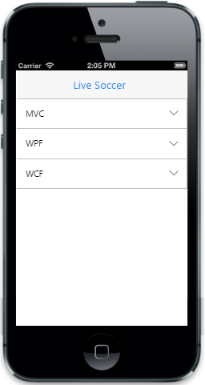

# Collapse content

In some cases, you may want to collapse the Accordion content dynamically due to limited space available in the screen. You can enable this feature by setting “CollapseAll” property to false. By clicking the Accordion header, you can collapse or expand the content.



    @Html.EJMobile().Accordion("accordion_sample").CollapseAll(true).Items(accItem =>
 {

     accItem.Add().Text("MVC").Content(@

        Model-view-controller (MVC) is a software architecture pattern which separates the representation of information from the user's interaction with it. The model consists of application data, business rules, logic, and functions

    
);

     accItem.Add().Text("WPF").Content(@

        Developed by Microsoft, the Windows Presentation Foundation (or WPF) is a computer-software graphical subsystem for rendering user interfaces in Windows-based applications

    
);

     accItem.Add().Text("WCF").Content(@

        WCF is a tool often used to implement and deploy a service-oriented architecture (SOA). It is designed using service-oriented architecture principles to support distributed computing where services have remote consumers.  .

    
);

 })







The following screenshot displays the collapse content:

