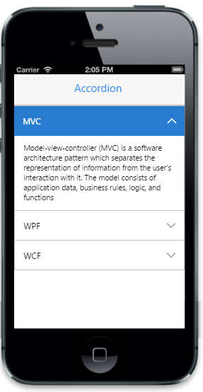

# Customize expand and collapse icon

The “ShowHeaderIcon” property is used to display the expand and collapse icon of the Accordion. By default, header icons are visible. To make the icons invisible, set 'ShowHeaderIcon' to false.



@Html.EJMobile().Accordion("accordion_sample").ShowHeaderIcon(true).Items(accItem =>{

          accItem.Add().Text("MVC").Content(@

                     Model-view-controller (MVC) is a software architecture pattern which separates the representation of information from the user's interaction with it. The model consists of application data, business rules, logic, and functions

                
);

          accItem.Add().Text("WPF").Content(@

                      Developed by Microsoft, the Windows Presentation Foundation (or WPF) is a computer-software graphical subsystem for rendering user interfaces in Windows-based applications 

                 
);

          accItem.Add().Text("WCF").Content(@

                      WCF is a tool often used to implement and deploy a service-oriented architecture (SOA). It is designed using service-oriented architecture principles to support distributed computing where services have remote consumers.  . 

                  
);

 })


The following screenshot displays expand and collapse icon

