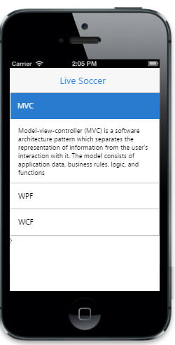

## Customize Header Icon

The “ShowHeaderIcon” property is used to display the default icon for the Accordion header. 

@{ Html.EJMobile().Accordion("accordion_sample").ShowHeaderIcon(true).Items(accItem =>{

          accItem.Add().Text("MVC").Content(@&lt;div&gt;

                     Model-view-controller (MVC) is a software architecture pattern which separates the representation of information from the user's interaction with it. The model consists of application data, business rules, logic, and functions

                &lt;/div&gt;);

          accItem.Add().Text("WPF").Content(@&lt;div&gt;

                      Developed by Microsoft, the Windows Presentation Foundation (or WPF) is a computer-software graphical subsystem for rendering user interfaces in Windows-based applications 

                 &lt;/div&gt;);

          accItem.Add().Text("WCF").Content(@&lt;div&gt;

                      WCF is a tool often used to implement and deploy a service-oriented architecture (SOA). It is designed using service-oriented architecture principles to support distributed computing where services have remote consumers.  . 

                  &lt;/div&gt;);

 }).Render();}

The following screenshot displays header icon:

{  | markdownify }
{:.image }

