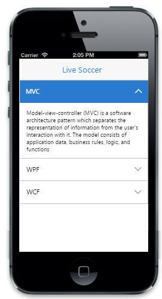

# Customize content height 

The “HeightAdjustMode” property is used to customize the height of each item’s content. It specifies the height style of the Accordion.  Set the “HeightAdjustMode” property with the following possible values.

* Content - This mode fits the height based on the content in the panel. 
* Auto - This mode sets the height based on the largest content in the panel.
* Fill - It automatically sets the dimensions of each Accordion item to the height of its parent container, that is, to fill the vertical space allocated by its container.


@Html.EJMobile().Accordion("accordion_sample").HeightAdjustMode(HeightAdjustMode.Auto).Items(accItem =>{

accItem.Add().Text("MVC").Content(@

Model-view-controller (MVC) is a software architecture pattern which separates the representation of information from the user's interaction with it. The model consists of application data, business rules, logic, and functions

);

accItem.Add().Text("WPF").Content(@

Developed by Microsoft, the Windows Presentation Foundation (or WPF) is a computer-software graphical subsystem for rendering user interfaces in Windows-based applications 

);

accItem.Add().Text("WCF").Content(@

WCF is a tool often used to implement and deploy a service-oriented architecture (SOA). It is designed using service-oriented architecture principles to support distributed computing where services have remote consumers.  . 

);

 })
 


The following screenshot displays the customized "auto" content height:

