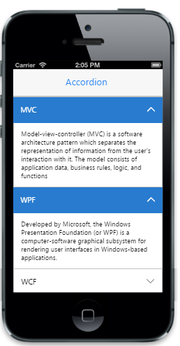

# Expand multiple content 

"EnableMultipleOpen" property is used to display or expand more than one item at a time. The index of the items to be expanded can be specified by using "SelectedItems" property as an array.



@Html.EJMobile().Accordion("accordion_sample").EnableMultipleOpen(true).SelectedItems(new int[] {0,1}).Items(accItem =>
 {

     accItem.Add().Text("MVC").Content(@

        Model-view-controller (MVC) is a software architecture pattern which separates the representation of information from the user's interaction with it. The model consists of application data, business rules, logic, and functions

    
);

     accItem.Add().Text("WPF").Content(@

        Developed by Microsoft, the Windows Presentation Foundation (or WPF) is a computer-software graphical subsystem for rendering user interfaces in Windows-based applications.

    
);

     accItem.Add().Text("WCF").Content(@

        WCF is a tool often used to implement and deploy a service-oriented architecture (SOA). It is designed using service-oriented architecture principles to support distributed computing where services have remote consumers.

    
);

 })


The following screenshot displays expand multiple contents:

