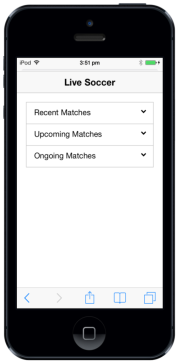
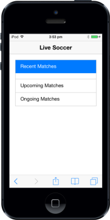
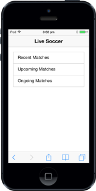
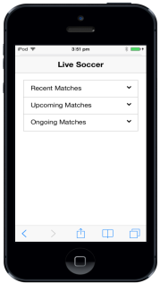
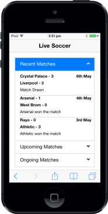
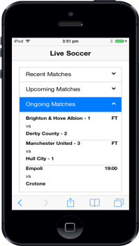

# Getting Started

This section briefly describes about how to create and customize Accordion widget.

## Create your first Accordion in MVC

The ASP.NET MVC Mobile Accordion Control provides a way to display collapsible content panels to present information in a limited amount of space. In the following guidelines, you can learn to create a Live Soccer App and through that you can learn the features in ASP.NET MVC Accordion widget.

In the above screenshot , you can click headers to expand/collapse content. You can also load content on demand, by specifing the URL to be loaded.

## Create the required layout

ASP.NET MVC Accordion widget is rendered, either by specifying static content, or by using on demand contents by specifying the respective URL. Either case, Accordion control is rendered based on the default values for all the properties. You can easily customize Accordion control by changing its properties according to your requirements. In the Live Soccer App, three Panels are required; one for displaying the Recent Matches, second for listing out the Upcoming Matches and another for displaying the Ongoing MatchesUpdates on the Live Soccer App. The following steps guide you to create a basic Accordion for your application.

Create a simple MVC application and paste the following header and scrollpanel layout page content inside the <body>tag of layout.cshtml. You can create a MVC Project and add necessary Dll’s and Scripts with the help of the [MVC Getting Started Documentation](https://help.syncfusion.com/aspnetmvc/getting-started).


       <!-- header control -->

       @Html.EJMobile().NavigationBar("header").Title("Live Soccer")

       

           

                    <!--Accordion control-->

           

       

      <!--Scroll Panel-->

       @Html.EJMobile().Scrollpanel("acc").Target("accordion")
       


To render Accordion control, you can call Accordion Helper Method. You can refer the following code example and add the following Layout code to the corresponding view page.


        <!--Accordion Control-->

   @Html.EJMobile().Accordion("accordionControl").Items(accItem =>
             {

                 accItem.Add().Text("Recent Matches");

                 accItem.Add().Text("Upcoming Matches");

                 accItem.Add().Text("Ongoing Matches");

             })



Run this code to render the following output.

## Select the accordion item

The SelectedItems property expands the specific content section, initially by using its index value. Multiple content sections can be expanded at a time. It accepts numeric array type. The default SelectedItems value is [0]. So the first panel is in expanded state. 


       <!--Accordion Control-->

      @Html.EJMobile().Accordion("accordionControl").SelectedItems(new int[] { 1 }).Items(accItem =>
             {

                 accItem.Add().Text("Recent Matches");

                 accItem.Add().Text("Upcoming Matches");

                 accItem.Add().Text("Ongoing Matches");

             })



## Enable expand and collapse icons

By default Header icons are  visible. To make the icons invisible, set "ShowHeaderIcon" property to false.


       <!--Accordion Control-->

          @Html.EJMobile().Accordion("accordionControl").ShowHeaderIcon(true).Items(accItem =>
             {

                 accItem.Add().Text("Recent Matches");

                 accItem.Add().Text("Upcoming Matches");

                 accItem.Add().Text("Ongoing Matches");

             })



## Make Accordion collapsible

By default, all the content sections are not collapsible. To make all its content section as collapsible, set 'CollapseAll' property to true.


        <!--Accordion Control-->
    @Html.EJMobile().Accordion("accordionControl").CollapseAll(true).Items(accItem =>
             {

                 accItem.Add().Text("Recent Matches");

                 accItem.Add().Text("Upcoming Matches");

                 accItem.Add().Text("Ongoing Matches");

             })


## Add content

In this use case example given, the contents of the Recent Matches and Upcoming Matches panels are given as static. In these content panels, the team results and match schedules are listed.

The following code example adds Recent Matches and Upcoming Matches panels’ content.


       <!--Accordion Control-->

     @Html.EJMobile().Accordion("accordionControl").Items(accItem =>
             {

                 accItem.Add().Text("Recent Matches").Content(
                    @

                        

                            Crystal Palace – 3
                            
6th May

                        

                        
Liverpool - 3

                        

                            Match Drawn
                        

                        

                        

                            Arsenal – 1
                            
4th May

                        

                        
West Brom - 0

                        

                            Arsenal won the match
                        

                        

                        

                            Rayo – 0
                            
3rd May

                        

                        
Athletic - 3

                        

                            Athletic won the match
                        

                    
); 

                 accItem.Add().Text("Upcoming Matches").Content(@

            

                Man City
                
8th May

            

            
vs

            

                Aston Villa
            

            

            

                Valladolid
                
8th May

            

            
vs

            

                Real Madrid
            

            

            

                Villarreal
                
10th May

            

            
vs

            

                Rayo
            

        
);

                 accItem.Add().Text("Ongoing Matches");
             })


## Load content on-demand

In some cases, you can load the Ajax content. content only when it is required. In this case, the OngoingMatches panel needs to be loaded only when you want to check for updates, since it refers a live content. To achieve this, specify AjaxUrl property with the respective URL of the view page file that contains the dynamic content.Specify “Href” attribute with the respective URL of the HTML file that contains the dynamic content. The data-ej-spinnertext attribute is used to show the loading text, while getting (waiting for) the response from the server (via Ajax request).



       <!--Accordion Control-->

    @Html.EJMobile().Accordion("accordionControl").EnableAjax(true).Items(accItem =>
             {

                 accItem.Add().Text("Recent Matches").Content(
                    @

                        

                            Crystal Palace – 3
                            
6th May

                        

                        
Liverpool - 3

                        

                            Match Drawn
                        

                        

                        

                            Arsenal – 1
                            
4th May

                        

                        
West Brom - 0

                        

                            Arsenal won the match
                        

                        

                        

                            Rayo – 0
                            
3rd May

                        

                        
Athletic - 3

                        

                            Athletic won the match
                        

                    
);

                 accItem.Add().Text("Upcoming Matches").Content(@

            

                Man City
                
8th May

            

            
vs

            

                Aston Villa
            

            

            

                Valladolid
                
8th May

            

            
vs

            

                Real Madrid
            

            

            

                Villarreal
                
10th May

            

            
vs

            

                Rayo
            

        
);
                 accItem.Add().Text("Ongoing Matche").Href(@Url.Content("~/accordion/load")); 
             });



Create a new view page with the name load.cshtml and assign its URL to AjaxUrl property.


      

      

                Brighton & Hove Albion  - 1
                
FT

            

            
vs

            

                Derby County  - 2
            

            

            

                Manchester United - 3

                
Ft

            

            
vs

            

                Hull City  -  1
            

            

            

                Empoli
                

                    19/div>
                

                
vs

                

                    Crotone
                

            



## Disable Cache

By default, Cache is disabled. So when you load the Ongoing Matches content, it loads its dynamic content, from the specified location only once. The next time, it loads the same content from Cache. In the case example, you need to load the dynamic content on every request by clicking its header. To achieve this, set EnableCache property to False.


<!--Accordion Control-->

      
    @Html.EJMobile().Accordion("accordionControl").EnableCache(true).EnableAjax(true).Items(accItem =>
             {

                 accItem.Add().Text("Recent Matches").Content(
                    @

                        

                            Crystal Palace – 3
                            
6th May

                        

                        
Liverpool - 3

                        

                            Match Drawn
                        

                        

                        

                            Arsenal – 1
                            
4th May

                        

                        
West Brom - 0

                        

                            Arsenal won the match
                        

                        

                        

                            Rayo – 0
                            
3rd May

                        

                        
Athletic - 3

                        

                            Athletic won the match
                        

                    
);

                 accItem.Add().Text("Upcoming Matches").Content(@

            

                Man City
                
8th May

            

            
vs

            

                Aston Villa
            

            

            

                Valladolid
                
8th May

            

            
vs

            

                Real Madrid
            

            

            

                Villarreal
                
10th May

            

            
vs

            

                Rayo
            

        
);
                 accItem.Add().Text("Ongoing Matche").Href(@Url.Content("~/accordion/load")); 
             });



From the above steps, you have learnt how to create and customize ASP.NET MVC Mobile Accordion widget with case examples. There are more customization properties other than the one used here. To know more about the properties, you can refer the complete documentation page of Mobile Accordion widget.

