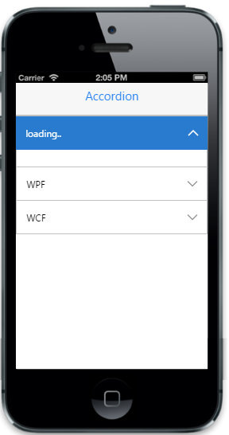

# Load on demand

In some cases, you can load content only when it is required. To achieve this, specify “AjaxUrl” property with the respective URL of the HTML file that contains the dynamic content. SpinnerText property is used to show the loading text, while getting (waiting for) the response from the server (via Ajax request).


@{ Html.EJMobile().Accordion("accordion_sample").SpinnerText("Loading..").Items(accItem =>

        {

         accItem.Add().Text("MVC").AjaxUrl("text1");

         accItem.Add().Text("WPF").AjaxUrl("text2");

         accItem.Add().Text("WCF").AjaxUrl("text3");

         }).Render();}


Create an HTML file with the name text1.html.


[HTML]

<body>

    Model-view-controller (MVC) is a software architecture pattern which separates the

    representation of information from the user's interaction with it.

    The model consists      of application data, business rules, logic, and functions

</body>



Create an HTML file with the name text2.html.


[HTML]

<body>

    Developed by Microsoft, the Windows Presentation Foundation (or WPF) is a 

    computer-     software graphical subsystem for rendering user interfaces 

    in Windows-based applications.

</body>


Create an HTML file with the name text3.html.


[HTML]

<body>

    WCF is a tool often used to implement and deploy a service-oriented architecture

    (SOA). It is designed using service-oriented architecture principles to support

    distributed computing where services have remote consumers.

</body>


The following screenshot displays the load on demand:

