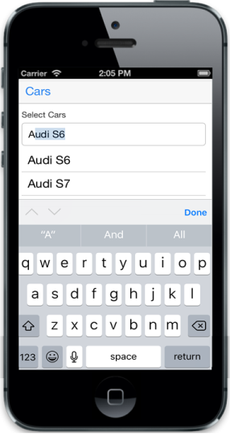

## AutoFill

EnableAutoFill property is used to automatically fill the AutoComplete textbox with the first suggestion result, when you enter the query. It matches the users query with the available suggestions and displays in the textbox as you type the phrase. By default, the value is set to “false”.

@model List<Cars>

@Html.EJMobile().AutoComplete("autocomplete_sample").DataSource(Model).Field("name").FilterType(AutoCompleteFilterType.StartsWith).EnableAutoFill(true)

The following screenshot displays AutoFill:

{{ '' | markdownify }}
{:.image }

