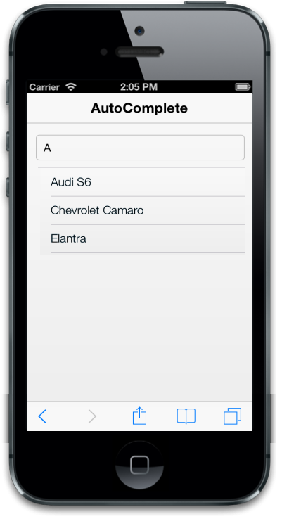

## Customize suggestion list

Items count

ItemsCount specifies the number of items to be displayed in the suggestion list. By default, the value for the property is “5”.

@model List<Cars>

@Html.EJMobile().AutoComplete("autocomplete_sample").DataSource(Model).Field("name").ItemsCount(2)

The following screenshot displays items count:

{{ '' | markdownify }}
{:.image }

FilterType

FilterType property is used to filter and display the suggestion list based on your requirements. The possible values are, 

1. Startswith
2. Contains

By default, the value for the property is “contains”.

@model List<Cars>

@Html.EJMobile().AutoComplete("autocomplete_sample").DataSource(Model).Field("name").FilterType(AutoCompleteFilterType.StartsWith)

EnableDistinct

EnableDistinct property is used to hide or show the duplicate items from the suggestion list. By default, the value for the property is “false”.

@model List<Cars>

@Html.EJMobile().AutoComplete("autocomplete_sample").DataSource(Model).Field("name").EnableDistinct(true)

Scrolling

The AllowScrolling property defines whether to allow the scrolling functionality or not in the suggestion list. Default value is set to true.

@model List<Cars>

@Html.EJMobile().AutoComplete("autocomplete_sample").DataSource(Model).Field("name").AllowScrolling(false)

The following screenshot displays the ouput:

{{ '' | markdownify }}
{:.image }

Sorting

AllowSorting property enables the sorting operation for the suggestion list. When it is set to true, the suggestion list is displayed in the sorting order that can be given by using the “SortOrder” property.

The possible values are,

1. Ascending
2. Descending

@model List<Cars>

@Html.EJMobile().AutoComplete("autocomplete_sample").DataSource(Model).Field("name").AllowScrolling(true).SortOrder(SortOrder.Descending).AllowSorting(true)

The following screenshot displays sorting:

{{ '' | markdownify }}
{:.image }

EmptyResult

ShowEmptyResultText property is used to show or hide the suggestion box when there is no suggestion available for the user query. By default, the value is “true”.

EmptyResultText property is used to customize the text that is displayed when no results appear in the suggestion list. By default, the value is “No Suggestions”.

@model List<Cars>

@Html.EJMobile().AutoComplete("autocomplete_sample").DataSource(Model).Field("name")").ShowEmptyResultText(true).EmptyResultText("No Values available")

The following screenshot displays empty result:

{{ '' | markdownify }}
{:.image }

