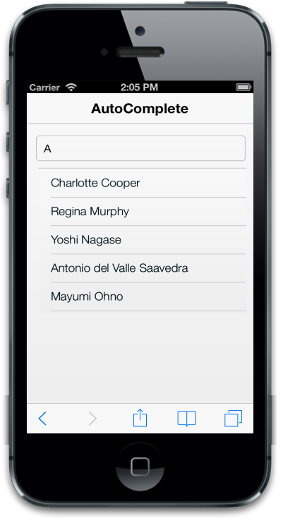
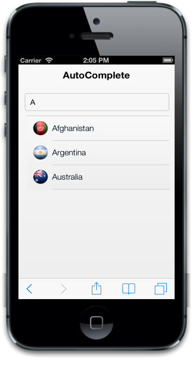

# Databinding

## Local Databinding

DataSource property is used to provide the suggestion list to the AutoComplete textbox. The list of items are passed as an array and by using the DataSource property, AutoComplete retrieves the suggestion list. Field property is used to map the specific field name of the given DataSource to render the suggestion list when user type is in the textbox. You can refer to the following code example.


@model List<Cars>

@Html.EJMobile().AutoComplete("autocomplete_sample").DataSource(Model).Fields(fields => fields.Text("name"))


For MVC, you need to pass the data through model. The code example defines the model with user-defined class.


  public class Cars

    {

        public string name { get; set; }

    }

    public static class carsModel  

    {

        public static List<Cars> source = new List<Cars>();

        public static List<Cars> setSource()

        {

            source.Add(new Cars { name = "Audi S6" });

            source.Add(new Cars { name = "BMW 7" });

            source.Add(new Cars { name = "Chevrolet Camaro" });

            source.Add(new Cars { name = "Duesenberg J" });

            source.Add(new Cars { name = "Elantra" });

            return source;

        }

    }


After creating the model, pass the data to the View through Controller.


public class AutoCompleteController : ApplicationController

    {       

        public ActionResult DefaultFunctionalities()

        {

            return View(carsModel.setSource());

        }

     }


The following screenshot displays the DataSource:

## Remote Databinding

Mapper property is used to specify the remote URL of the DataSource for the suggestion list. 


@model List<Cars>

@Html.EJMobile().AutoComplete("autocomplete_sample").WatermarkText("Select Customer").FilterType(AutoCompleteFilterType.StartsWith).CaseSensitiveSearch(true).DataSource(d => d.URL("http://mvc.syncfusion.com/Services/Northwnd.svc/Suppliers")).Fields(fields => fields.Text("ContactName"))


The following screenshot displays remote data binding:

## ImageField

ImageField property is used to map the specific field name of the given DataSource to render the icons/images for each suggestion list. The mapped field should contain the icon/image URL for each suggestion list.


@model List<Countries>

@Html.EJMobile().AutoComplete("autocomplete_sample").DataSource(Model).Fields(fields=>fields.Text("country").Image("flag"))



For MVC, pass the DataSource through model. You can refer to the code example for defining the DataSource in the model.


public class Countries

    {

        public string country { get; set; }

        public string flag { get; set; }

    }

    public static class CountriesModel

    {

        public static List<Countries> source = new List<Countries>();

        public static List<Countries> setSource()

        {

            source.Add(new Countries {country="Afghanistan" ,flag=VirtualPathUtility.ToAbsolute("~/themes/sample/autocomplete/afghanistan.png")});

            source.Add(new Countries {country="Argentina" ,flag=VirtualPathUtility.ToAbsolute("~/themes/sample/autocomplete/argentina.png")});

            source.Add(new Countries {country="Australia" ,flag=VirtualPathUtility.ToAbsolute("~/themes/sample/autocomplete/Australia.png")}); 

            return source;

        }


The following screenshot displays the ImageField:

## ImageClass

ImageClass property is used to map the specific field name of the given DataSource to render the icons/images for each suggestion list. The mapped field should contain the CSS class names that define the icons/images for each suggestion list. You can customize the CSS class definitions for icons of each suggestion list based on the need.


@model List<Countries>

@Html.EJMobile().AutoComplete("accmultivalue").DataSource(Model).Fields(fields=>fields.Text("country").Image("flag"))







For MVC, the class has to be referred in the model list.


    public class Countries

    {

        public string country { get; set; }

        public string flag { get; set; }

    }

    public static class CountriesModel

    {

        public static List<Countries> source = new List<Countries>();

        public static List<Countries> setSource()

        {

            source.Add(new Countries {country="Afghanistan" ,flag="afghan"});

            source.Add(new Countries {country="Argentina" ,flag="argen"});

            source.Add(new Countries {country="Australia" ,flag="aust"});

        }

        public static void clearSource()

        {

            source.Clear();

        }

    }


The following screenshot displays ImageClass:

