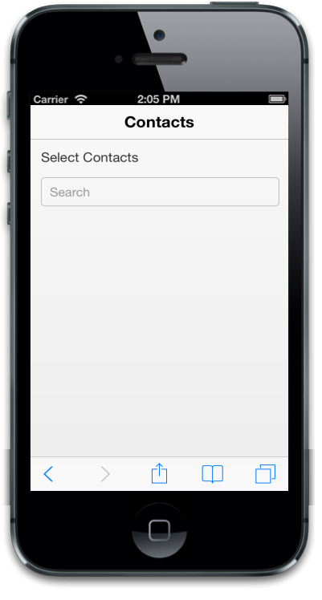
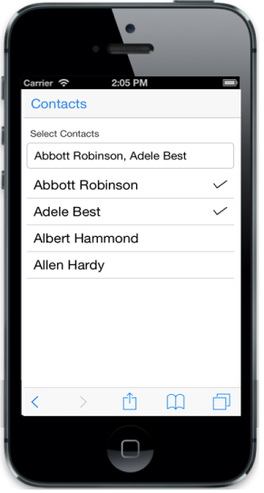
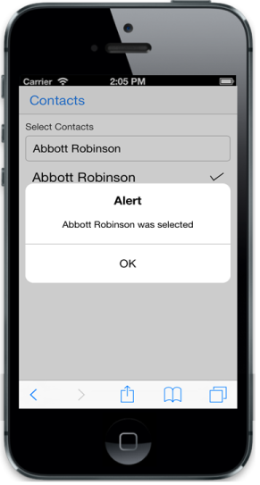

# Getting Started

This section explains briefly on how to create an AutoComplete control in your application.

## Create your first AutoComplete Text box in MVC

The ASP.NET MVC Mobile AutoComplete control is a textbox control that provides a list of suggestions based on the query.  When you enter text into the text box, the control performs a search operation and provides a list of results. There are several filter types available, to perform the search. In the following example, you can learn how to create an application to search for a contact and learn about the features in AutoComplete widget.

### Create AutoComplete to search for a contact

ASP.NET MVC Mobile AutoComplete control can be rendered based on the default values of all the properties. You can easily customize Mobile AutoComplete control by changing its properties. The following code example shows how to create AutoComplete to search for a contact. 

Create a simple MVC application and paste the following header and scrollpanel layout page content inside the body tag of layout.cshtml and paste other templates in the view page for AutoComplete creation.

You can create an MVC Project and add necessary Dlls and script, with the help of the [MVC-Getting Started Documentation](https://help.syncfusion.com/aspnetmvc/getting-started) for Mobile.

Add the following code layout to the corresponding master page.



  @Html.EJMobile().NavigationBar("Header").Title("Contacts")
                

                    

                     @*Render Autocomplete control*@

                    

                

	


Add the following code example to render the AutoComplete control in the corresponding view page.



        Select Contacts

    

 <!-- Autocomplete control -->

@Html.EJMobile().AutoComplete("contacts")   


## Customize watermark text

You can customize watermark text using the WatermarkText property as follows.


     <!-- Autocomplete control -->

@Html.EJMobile().AutoComplete("contacts").WatermarkText("Search Contacts")


## Data Binding

You need to add model, to sync the contact items to AutoComplete. For that, you can have to add a class file named contact.cs in the model folder. 



namespace MvcApplication.Models
{
    public class Contacts
    {
        public int uniqueKey { get; set; }
        public string name { get; set; }
        public static List<Contacts> setSource()
        {
            List<Contacts> list = new List<Contacts>();
            list.Add(new Contacts { name = "Audi S6" });
            list.Add(new Contacts { name = "Austin-Healey" });
            list.Add(new Contacts { name = "Alfa Romeo" });
            list.Add(new Contacts { name = "Aston Martin" });
            list.Add(new Contacts { name = "BMW 7" });
            list.Add(new Contacts { name = "Bentley Mulsanne" });
            list.Add(new Contacts { name = "Bugatti Veyron" });
            list.Add(new Contacts { name = "Chevrolet Camaro" });
            list.Add(new Contacts { name = "Cadillac" });
            list.Add(new Contacts { name = "Duesenberg J" });
            list.Add(new Contacts { name = "Dodge Sprinter" });
            list.Add(new Contacts { name = "Elantra" });
            list.Add(new Contacts { name = "Excavator" });
            list.Add(new Contacts { name = "Ford Boss 302" });
            list.Add(new Contacts { name = "Ferrari 360" });
            list.Add(new Contacts { name = "Ford Thunderbird" });
            list.Add(new Contacts { name = "GAZ Siber" });
            list.Add(new Contacts { name = "Honda S2000" });
            list.Add(new Contacts { name = "Hyundai Santro" });
            list.Add(new Contacts { name = "Isuzu Swift" });
            list.Add(new Contacts { name = "Infiniti Skyline" });
            list.Add(new Contacts { name = "Jaguar XJS" });
            list.Add(new Contacts { name = "Kia Sedona EX" });
            list.Add(new Contacts { name = "Koenigsegg Agera" });
            list.Add(new Contacts { name = "Lotus Esprit" });
            list.Add(new Contacts { name = "Lamborghini Diablo" });
            list.Add(new Contacts { name = "Mercedes-Benz" });
            list.Add(new Contacts { name = "Mercury Coupe" });
            list.Add(new Contacts { name = "Maruti Alto 800" });
            return list;
        }
    }
}



Add the corresponding namespace for model in controller and modify the existing controller as follows. 



using MvcApplication.Models;

public ActionResult Contacts()

        {
            ViewBag.datasource = Contacts.setSource();

            return View();

        }



N> Here “MVCSample” is your project name.


     <!-- Autocomplete control -->

    @using MvcApplication.Models;

    @Html.EJMobile().AutoComplete("accdefault").WatermarkText("Search Contacts ").DataSource((IEnumerable<Contacts>)ViewBag.datasource).Fields(fields=>fields.Text("name")).FilterType(AutoCompleteFilterType.Contains)



Run the above code and type the contact details to search for (In this example, you can type A) in the AutoComplete textbox, and you can see the result displayed.

## Multi Value Selection

AutoComplete textbox enables you to select multiple items from the suggestions list. To achieve this, set the EnableMultiSelect property to true. The DelimiterChar property holds a string value that specifies the separator between two selected items.  You can customize the delimiter string. In this example “;” is used as delimiter.


     <label>Select Contacts</label>
     <!-- Autocomplete control -->

@model List<Contacts>

            @Html.EJMobile().AutoComplete("accdefault").WatermarkText("Search Contacts ").DataSource(Model).Fields(fields => fields.Text("name")).FilterType(AutoCompleteFilterType.Contains). EnableMultiSelect(true).DelimiterChar(";")    


Run the above code and type the necessary query in the textbox. The contact is displayed as shown in the following screenshot.

## Event handling

The Select eventenables you to handle AutoComplete selection. By assigning a function name to the event, you can handle the selection. Here you can set Select event with the function name OnSelect.  By processing the onSelect( ) function, you can implement the necessary actions. In this example, the full Contact detail of the selected contact name is displayed. 


          <!-- Autocomplete control -->

    @Html.EJMobile().AutoComplete("contacts").WatermarkText("Search Contacts").DataSource(Model).Fields(fields => fields.Text("name")).EnableMultiSelect(true).DelimiterChar(";").ClientSideEvents(c => c.Select("onSelect"))

        <!-- onSelect() function is called on selection of a suggestion item.-->
        <!-- Dialog control -->

    @Html.EJMobile().Dialog("dialog").Title("Alert").EnableModal(true).LeftButtonCaption("OK").ClientSideEvents(c=>c.ButtonTap("")).Content(@
<!--Dialog content-->
)

     

    



