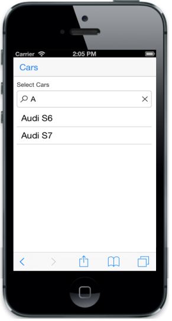

# Mode

Mode property specifies the textbox type. The possible values are,

1. Default
2. Search

Default is used to render the AutoComplete as normal textbox. Search is used to render the control with search icon. Default value for the property is “default”.


@model List<Cars>

@Html.EJMobile().AutoComplete("autocomplete_sample").DataSource(Model).Fields(fields=>fields.Text("name")).Mode(Mode.Search)



The following screenshot displays Mode:

