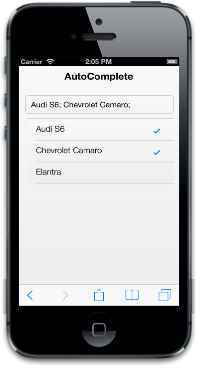

## Multi Selection

This feature is enabled by setting the “EnableMultiSelect” property to true.

DelimiterChar

DelimiterChar is used to separate two or more items in the AutoComplete textbox. When you set DelimiterChar property then the value gets accepted in the textbox only after the delimiter character. Default value is “,”.

You can refer to the following code examples.

@model List<Cars>

@Html.EJMobile().AutoComplete("autocomplete_sample").WatermarkText("Select a car").DataSource(Model).Field("name").EnableMultiSelect(true).DelimiterChar(";")

The following screenshot displays the DelimiterChar:

{{ '' | markdownify }}
{:.image }

EnableCheckBox

EnableCheckBox property is used to display the checkbox for the suggestion list. This property is rendered only in the multi-value mode. By default, the value is set to “true”.

@model List<Cars>

@Html.EJMobile().AutoComplete("autocomplete_sample").DataSource(Model).Field("name").EnableMultiSelect(true).EnableCheckbox(true)

The following screenshot displays EnableCheckBox:

{{ '' | markdownify }}
{:.image }

