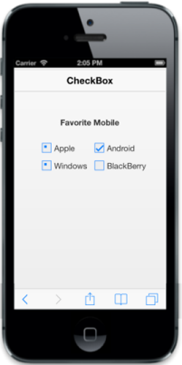
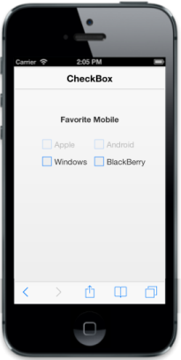

# Easy customization

## Checked Status

By using checked property, you can set the state of Checkbox. When checkedproperty is true, the Checkbox is in checked state. When false, Checkbox is in unchecked state. When you want to use this checkedproperty, then checkbox should be in non Tri-state and enableTriState property should be false.

The following code explains you the details about rendering the Checkbox with above mentioned checked options, when the checkbox is in non tri-state.

In the CSHTML page, add the following input elements to configure Checkbox widget.



Choose Your Favorite Search Engines

    <table id="main">

        <tr>

            <td>

                 @Html.EJMobile().CheckBox("chkbox", new { id = "Checkbox1" }).Text("Google").Checked(true)

            </td>

        </tr>

        <tr>

            <td>

                @Html.EJMobile().CheckBox("chkbox", new { id = "Checkbox2" }).Text("Yahoo").Checked(true)

            </td>

        <tr />

        <tr>

            <td>

                @Html.EJMobile().CheckBox("chkbox", new { id = "Checkbox3" }).Text("Bing")

            </td>

        <tr />

        <tr>

            <td>

                @Html.EJMobile().CheckBox("chkbox", new { id = "Checkbox4" }).Text("Wikipedia").Checked(true)

            </td>

        <tr />

        <tr>

            <td>

                @Html.EJMobile().CheckBox("chkbox", new { id = "Checkbox5" }).Text("Amazon")

            </td>

        <tr />

        <tr>

            <td>

                @Html.EJMobile().CheckBox("chkbox", new { id = "Checkbox6" }).Text("Twitter")

            </td>

        <tr />

    </table>

    

        <button id="submit" data-role="ejmbutton">SUBMIT</button>

    



## Enable Tri-State

Sometimes, to represent the answer in partially true state, you can use the indeterminate state option that is the state between checked and unchecked state. For example, a Checkbox presented to select files to send via [FTP](http://en.wikipedia.org/wiki/File_Transfer_Protocol) can use a [tree view](http://en.wikipedia.org/wiki/Tree_view) so that files can be selected one at a time, or by folder. When only some files in a folder are selected, then the checkbox for that folder could be in indeterminate state.

When you enable Tri-state, then the Checkbox includes the indeterminate state. The Checkbox has three states. enableTriState property specifies to enable or disable the Tri-State option for Checkbox.

In theCSHTML page, add the following input elements to render the Checkbox with Tri-state options.



@Html.EJMobile().Header("sample_header").Title("CheckBox")

    

        <b>Favorite Mobile</b>

    

     

    <table border="0" cellpadding="6">

        <tr>

            <td width="100px">

                @Html.EJMobile().CheckBox("apple").Text("Apple").EnableTriState(true).CheckState(CheckState.Indeterminate)

            </td>

            <td width="100px">

                @Html.EJMobile().CheckBox("android").Text("Android").EnableTriState(true).CheckState(CheckState.Check)

            </td>

        </tr>

        <tr>

            <td width="100px">

                @Html.EJMobile().CheckBox("windows").Text("Windows").EnableTriState(true).CheckState(CheckState.Indeterminate)

            </td>

            <td width="100px">

                @Html.EJMobile().CheckBox("Bberry").Text("BlackBerry")

            </td> 

        </tr>

    </table>



Execute the above code example to render the following output.

## Enabled 

You can render Checkbox with disabled state by setting data-ej-enabled to false. Sometimes, to disable a checkbox during ‘out of stock’ like situations, you can use this property. By default, this data-ej-enabled is set to true.

Refer to the following code example.



@Html.EJMobile().Header("sample_header").Title("CheckBox")

    

        <b>Favorite Mobile</b>

    

     

    <table border="0" cellpadding="6">

        <tr>

            <td width="100px">

                @Html.EJMobile().CheckBox("apple").Text("Apple").Enabled(false)

            </td>

            <td width="100px">

                @Html.EJMobile().CheckBox("android").Text("Android").Enabled(false)

            </td>

        </tr>

        <tr>

            <td width="100px">

                @Html.EJMobile().CheckBox("windows").Text("Windows").

            </td>

            <td width="100px">

                @Html.EJMobile().CheckBox("Bberry").Text("BlackBerry")

            </td>

        </tr>

    </table>



 Execute the above code example to render the following output.

