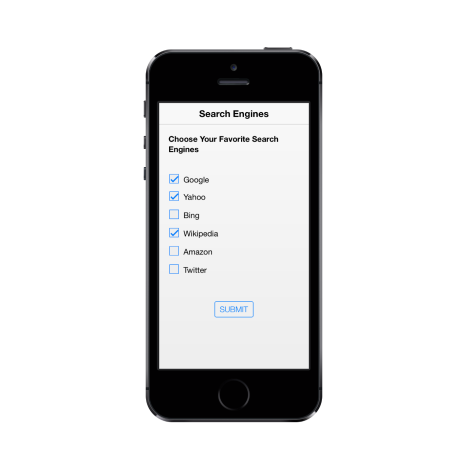

# Getting Started

This section briefly describes about how to create and customize ASP.NET MVC Mobile Checkbox widget.

## Create your first Checkbox in ASP.NET MVC

From the following guidelines, you can select Multiple or Single Selection List by using Checkbox. The following screenshot demonstrates the functionality with Checkbox button action.

In the above screenshot, you can select multiple search engines as your favorites by using Checkbox, Tri-State Checkbox and perform the action to render the checked values when the button is clicked.

### Create Checkbox 

Essential ASP.NET MVC Mobile Checkbox widget has built-in features like indeterminate selections. You can easily create the Checkbox widget by using Html helper codes as follows. 

Create a simple MVC application and add the following header and scrollpanel controls inside the <body> tag of layout.cshtml. 

For creating a MVC Project, adding necessary Dll’s and Scripts can be done with help of the [MVC-Getting Started Documentation](http://help.syncfusion.com/js/) for mobile. 



<!-- header control -->          

@Html.EJMobile().Header("header").Title("Search Engines")

        

            

                @RenderBody()

            
			

        

<!-- ScrollPanel -->        

@Html.EJMobile().Scrollpanel("scroll").Target("content") 



Add the following Layout code to the corresponding view page.



Choose Your Favorite Search Engines

    <table id="main">

        <tr>

            <td>

                 @Html.EJMobile().CheckBox("chkbox", new { id = "Checkbox1" }).Text("Google").Checked(true)

            </td>

        </tr>

        <tr>

            <td>

                @Html.EJMobile().CheckBox("chkbox", new { id = "Checkbox2" }).Text("Yahoo").Checked(true)

            </td>

        <tr />

        <tr>

            <td>

                @Html.EJMobile().CheckBox("chkbox", new { id = "Checkbox3" }).Text("Bing")

            </td>

        <tr />

        <tr>

            <td>

                @Html.EJMobile().CheckBox("chkbox", new { id = "Checkbox4" }).Text("Wikipedia").Checked(true)

            </td>

        <tr />

        <tr>

            <td>

                @Html.EJMobile().CheckBox("chkbox", new { id = "Checkbox5" }).Text("Amazon")

            </td>

        <tr />

        <tr>

            <td>

                @Html.EJMobile().CheckBox("chkbox", new { id = "Checkbox6" }).Text("Twitter")

            </td>

        <tr />

    </table>

    

        <button id="submit" data-role="ejmbutton">SUBMIT</button>

    



Add the following styles to show the Checkbox control in an order. 



    



Run this code example and you can see the following output.

