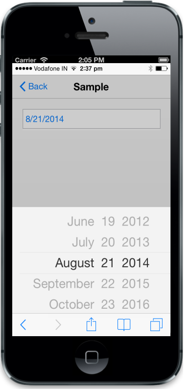

# Configure date                                        

The maxdate and mindate properties are used to denote the maximum and minimum selectable dates. You can format the date by using the DateFormat property. The current value for DatePicker can be set by using the value property.



@Html.EJMobile().DatePicker("datepicker").MaximumDate("10/10/2020").MinimumDate("05/05/2005").Value("08/21/2014").DateFormat("MM/dd/yyyy")


The following screenshot displays the output.

