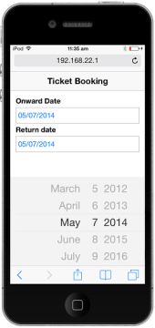
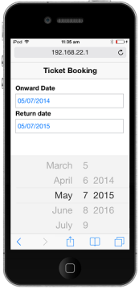
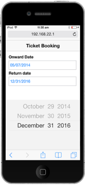

# Getting Started

This section briefly describes how to create a DatePicker control in your application.

## Create your first DatePicker in MVC

The ASP.NET MVC DatePicker allows you to display the picker element in your webpage and allows you to pick the date. From the following guidelines, you can learn how to customize two DatePickers for a real-time ticket booking scenario. The following screenshot will demonstrate the functionality of DatePicker.

### Create a DatePicker 

ASP.NET MVC Mobile DatePicker widget can easily be created by using the MobileDatePicker Helper. To create an MVC Project and to add necessary Dlls and script, use the [MVC-Getting Started Documentation](http://help.syncfusion.com/js/).

1. Add the following code example to the corresponding view page.

   ~~~ html

			@Html.EJMobile().Header("header").Title("Ticket Booking")

			<div id="content_container">
			
			    		

			
			       		<!-- Add DatePicker Elements here -->
			
			   		 	

			

   ~~~
   {:.prettyprint }

2. To render the DatePicker control, you can add the following code example, where two DatePickers are added, to specify start and end date.

   ~~~ html
    
			<table>
			
			            <tr>
			
			                <td class="tdclass">Onward Date</td>
			
			            </tr>
			
			            <tr>
			
			                <td class="tdclass">
			
			                    <span class="innerdp">
			
			              <!-- DatePicker control -->
			
			              @Html.EJMobile().DatePicker("startDate")
			
			                    
			
			                </td>
			
			            	</tr>
			
			            	<tr>
			
			                <td class="tdclass">Return date</td>
			
			            	</tr>
			
			            	<tr>
			
			                <td class="tdclass">
			
			                    <span class="innerdp">
			
			              	<!-- DatePicker control -->
			
			              	@Html.EJMobile().DatePicker("endDate")
			
			                    
			
			                </td>
			
			            	</tr>
			
			</table>

   ~~~
   {:.prettyprint }

3. Apply the following styles to align the DatePickers.

   ~~~ css
    
			

   ~~~
   {:.prettyprint }

4. Run the above code example and you can see the following output.

   

With the above mentioned steps, you can create two MobileDatePicker widgets in a page.

###  Set the Min and Max Date

In a real-time ticket booking scenario, the booking is open only for a limited number of days. You can select a date from that range. You can achieve this by using the properties minDate and maxDate. 


    
	



Run the above code example to render the following output.

### Set Event to Process Min and Max Date Validations

In the first DatePicker, after you select the Onward Journey Date, the Return Journey Date must be selected. This validation process is done after the selection of Onward Journey Date and the changes must be reflected on the Return Journey Date selection DatePicker. You can manipulate this process using the Select event of Onward Date Picker.

        <table>

            <tr>

                <td class="tdclass">Onward Date</td>

            </tr>

            <tr>

                <td class="tdclass">

                    

              <!-- DatePicker control -->

              @Html.EJMobile().DatePicker("startDate").ClientSideEvents(eve => { eve.Select("selectedStartDate");})

                

                </td>

            </tr>

            <tr>

                <td class="tdclass">Return date</td>

            </tr>

            <tr>

                <td class="tdclass">

                    

              <!-- DatePicker control -->

              @Html.EJMobile().DatePicker("endDate")

                    

                </td>

            </tr>

        </table>    



By selecting the Onward Journey Date in the first DatePicker, you can select the Return Journey Date with the limited range. Add the following code example, to set the maxDate, to restrict false selection of date.


    


Run the above code and you can see the following output.

By following the above mentioned steps, you can customize the MobileDatePicker widget in an efficient manner. You can also add additional functionalities to DatePicker like localization and date formats.
