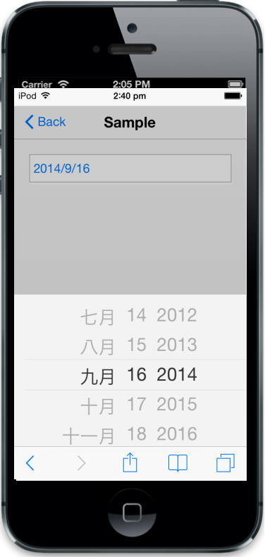

# Localization                         

The culture property is used to enable the localization support. The default value is en-US.


@Html.EJMobile().DatePicker("datepicker").Culture("zh-CN")


The following screenshot displays the output.

