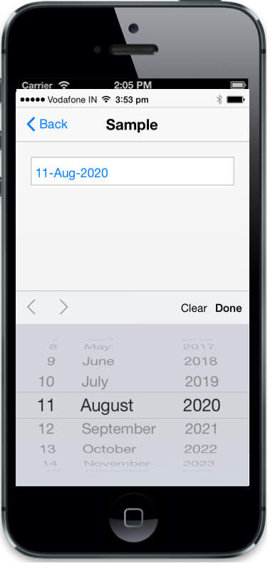

## Native DatePicker

The RenderDefault property is used to enable the iOS7 native DatePicker. But, by using iOS7 native DatePicker, you cannot customize its theme, provide localization support, etc. The default value is false.

@Html.EJMobile().DatePicker("datepicker").RenderMode(RenderMode.IOS7).IOS7(IOS7=>IOS7.RenderDefault(true))

The following screenshot displays the output.

{{ '' | markdownify }}
{:.image }

