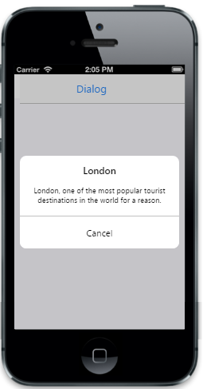

# Auto Open

The EnableAutoOpen property is used to open the Dialog box on initial loading. The default value is false.



            @{

                @Html.EJMobile().Dialog("alertdlg").Title("London").LeftButtonCaption("Cancel").EnableAutoOpen(true).Content(@

                    London, one of the most popular tourist destinations in the world for a reason.

                
)

            }


The following screenshot displays the output.

