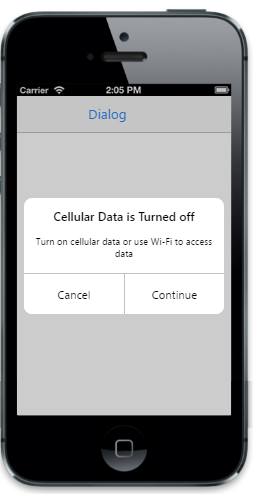
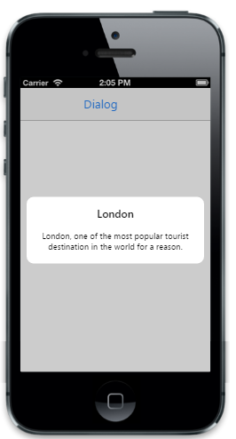

# Button Customization

## Left button caption
 
 To specifies the text of the Left Button. The default value is Cancel.


@{

@Html.EJMobile().Dialog("alertdlg").Title("Cellular Data is Turned off").LeftButtonCaption("OK").EnableAutoOpen(true).Mode(DialogMode.Confirm).Content(

@

Turn on cellular data or use Wi-Fi to access data

)

}


The following screenshot displays the output.

## Right button caption

To specifies the text of the Right Button. The default value is continue.


@{

@Html.EJMobile().Dialog("alertdlg").Title("Cellular Data is Turned off").RightButtonCaption("Continue").EnableAutoOpen(true).Mode(DialogMode.Confirm).Content(

@

Turn on cellular data or use Wi-Fi to access data

)

}


The following screenshot displays the output.

## Show buttons                                

 To show the buttons in the Dialog box. The default value is true.


@{

    @Html.EJMobile().Dialog("alertdlg").Title("London").RightButtonCaption("Continue").EnableAutoOpen(true).ShowButtons(false).Mode(DialogMode.Confirm).Content(

        @

             London, one of the most popular tourist destination in the world for a reason.

        
)

}


The following screenshot displays the output.

