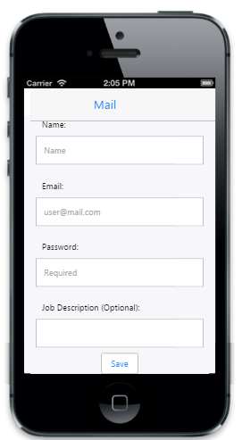
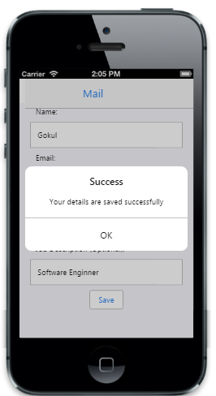
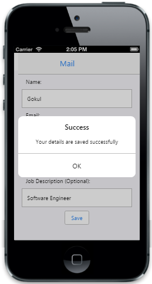

# Getting Started

This section explains briefly on how to create a Dialog control in your application.

## Create your first Dialog in MVC

The ASP.NET MVCDialog window is an overlay positioned within the AppView and displays a message along with supplementary content such as images or text and interactive content such as forms etc. It contains a title and a content area. The following example explains how to create a MailSign in form through that you can learn the features of the ASP.NET MVC Dialog widget.

{  | markdownify }
{:.image }

_Alert Dialog_  

Create the required layout

You can render the Dialog control based on the default values for all the properties. You can easily customize Dialog control by changing its properties according to your requirement. Create a simple MVC application and add the following header and scrollpanel layout page content inside the &lt;body&gt; tag of layout.cshtml. For creating a MVC Project, adding necessary Dll’s and Scripts can be done with help of the [MVC-Getting Started Documentation](http://help.syncfusion.com/ug/js/default.htm) for mobile. 

&lt;!-- header control --&gt;          

@Html.EJMobile().Header("header").Title("Mail").RightButtonCaption("Next").ShowRightButton(true).ClientSideEvents(evt => { evt.RightButtonTap("formsubmit"); })

        &lt;div id="content"&gt;

            &lt;div&gt;

                @RenderBody()

            &lt;/div&gt;			

        &lt;/div&gt;

&lt;!-- ScrollPanel --&gt;        

@Html.EJMobile().Scrollpanel("scroll").Target("content") 

Add the following Layout code to the corresponding view page

&lt;div id="content"&gt;

    &lt;div&gt;

        &lt;!-- Adding Mail Sign in Form --&gt;

        &lt;form id="form1"&gt;

            &lt;label&gt;

                Name:

            &lt;/label&gt;

            &lt;div&gt;

                @Html.EJMobile().TextBox("name_def").WatermarkText("Name")

                &lt;label for="name_def" class="error" generated="true" /&gt;

            &lt;/div&gt;

            &lt;label&gt;

                Email:

            &lt;/label&gt;

            &lt;div&gt;

                @Html.EJMobile().TextBox("email_def").WatermarkText("user@mail.com")

                &lt;label for="email_def" class="error" generated="true" /&gt;

            &lt;/div&gt;

            &lt;label&gt;

                Password:

            &lt;/label&gt;

            &lt;div&gt;

                @Html.EJMobile().PassWord("password_def").WatermarkText("Required")

                &lt;label for="password_def" class="error" generated="true" /&gt;

            &lt;/div&gt;

            &lt;label&gt;

                Job Description (Optional):

            &lt;/label&gt;

            &lt;div&gt;

                @Html.EJMobile().TextBox("description_def")

            &lt;/div&gt;

        &lt;/form&gt;

        &lt;!-- Adding Dialog Helper Here --&gt;

@Html.EJMobile().Scrollpanel("scroll").Target("content")

Use the following styles for adding content element.

&lt;style type="text/css"&gt;

    .appview.e-m-ios7 #content {

        background: #dddddd;

        padding: 10px;

    }

    #form > div {

        padding: 10px 0;

    }

    .appview #form1 label.error {

        color: Red;

    }

    .e-m-ios7 label {

        padding-left: 10px;

    }

    .e-m-windows label {

        padding-left: 20px;

    }

    .e-m-android #content, .e-m-ios7 #content {

        padding: 10px;

    }

    .e-m-android #form1 {

        padding: 0px 10px;

    }

    .e-m-windows #content {

        padding: 3px;

    }

&lt;/style&gt;

Execute this code to render the following output. For more details, to run the sample refers "Common Getting Started" section.

{  | markdownify }
{:.image }

_Mail Sign in Form_

Create the Dialog control

There are four types of Dialog modes namely alert, confirm, normal and full view Dialogs. The defaultDialog mode is “alert”. In your use case, an error message is displayed when invalid details are entered. AlertDialog contains title, content and a button. 

To render the Dialog control, you can add the following code example and specify the Dialog content (HTML content) using “Content” API. Specify a value for “Title” property to set title for Dialog. In your case you can set it as “Invalid email address”. Specify a value for “LeftButtonCaption” property to set Dialog button text; here you can set it as “OK”. 

        @Html.EJMobile().Dialog("alertdlg").Title("Success").LeftButtonCaption("OK").Content(@&lt;div id="contentDialog"&gt;&lt;/div&gt;)

    &lt;/div&gt;

&lt;/div&gt;

Display the Dialog

To display the Dialog, you can click the next button present in the header. The click event is handled by “formsubmit” function as mentioned as follows. Create an object for Dialog control and then using the dialog’s “open” function you can display the Dialog. 

Add the following script code to the &lt;body&gt; tag.

&lt;script type="text/javascript"&gt;

        function formsubmit(event) {

            validation();

            $("#form1").submit();

            $("#ScrollPanel").ejmScrollPanel("refresh");

        }

        function validation() {

            validator = $("#form1").validate({

                messages: {

                    name_def: { required: "Please enter user name" },

                    password_def: { required: "Please enter password" },

                    email_def: { required: "Please enter e-mail" }

                },

                submitHandler: function (form) {

                    var dialogObject = $("#alertdlg").data("ejmDialog"); // creating instance for dialog

                    dialogObject.open();

                    $("#contentDialog").text("Your details are saved successfully");

                }

            });

        }

&lt;/script&gt;

Execute this code to render the following output. For more details, to run the sample refers "Common Getting Started" section.

{  | markdownify }
{:.image }

Enable Modal Dialog

The EnableModalDialog prevents you from interacting with the rest of the page until it is closed. Enable the modal Dialog using “EnableModal” property.

        @Html.EJMobile().Dialog("alertdlg").Title("Success").LeftButtonCaption("OK").Content(@&lt;div id="contentDialog"&gt;&lt;/div&gt;).EnableModal(true)

    &lt;/div&gt;

&lt;/div&gt;

Execute this code to render the following output. For more details, to run the sample refers "Common Getting Started" section.

{  | markdownify }
{:.image }

Handle Dialog events

To close the alert Dialog, click OK. This is achieved by triggering the ButtonTap event of Dialog. The ButtonTap event is handled by alertClose function. Create an object for Dialog control and using close function you can close the Dialog.

Refer to the following code example. 

        @Html.EJMobile().Dialog("alertdlg").Title("Success").LeftButtonCaption("OK").Content(@&lt;div id="contentDialog"&gt;&lt;/div&gt;).EnableModal(true).ClientSideEvents(evt => { evt.ButtonTap("alertClose"); })

    &lt;/div&gt;

&lt;/div&gt;

//Button tap event handling

        function alertClose(event) {

            var alertDlgInstance = $("#alertdlg").data("ejmDialog"); // Create alert dialog instance

            alertDlgInstance.close(); // To close alert dialog

            $(".e-m-text-input").val("");

            $(".e-m-editor-input").val("");

        }

