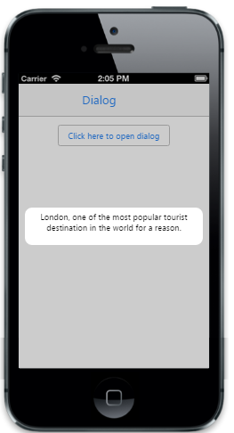

# Mode

The Mode property specifies the different types of dialog modes. The possible values are, 

1. Alert mode. 
2. Confirm mode.
3. Custom mode.

## Alert Mode

The AlertDialog box property is used to communicate an Alert message.



@{

@Html.EJMobile().Dialog("alertdlg").Mode(DialogMode.Alert).Content(

@

5% of battery remaining

)

}

@Html.EJMobile().Button("btn1").Text("Click here to open dialog").ClientSideEvents(evt => { evt.TouchEnd("openAlertDialog"); })





        function openAlertDialog(args)

        {

            App.activePage.find("#alertdlg").ejmDialog("open");

        }



The following screenshot displays the output.

## Confirm Mode

The ConfirmDialog box property is mostly used to take the user's content on any option. It displays a Dialog box with two buttons, Ok and Cancel. Ok button returns true and Cancel button returns false.



@{

@Html.EJMobile().Dialog("alertdlg").Title("Cellular Data is Turned off").Mode(DialogMode.Confirm).Content(

@

Turn on cellular data or use Wi-Fi to access data

)

}

@Html.EJMobile().Button("btn1").Text("Click here to open dialog").ClientSideEvents(evt => { evt.TouchEnd("openAlertDialog"); })





        function openAlertDialog(args)

        {

            App.activePage.find("#alertdlg").ejmDialog("open");

        }



The following screenshot displays the output.

## Custom Mode

The custom'Mode' Dialog box property  displays the dialog as custom type.




            @{

                @Html.EJMobile().Dialog("alertdlg").Title("Welcome").Mode(DialogMode.Custom).Content(

                    @

                         London, one of the most popular tourist destination in the world for a reason.

                    
)

            }

            

                @Html.EJMobile().Button("btn1").Text("Click here to open dialog").ClientSideEvents(evt => { evt.TouchEnd("openAlertDialog"); })

            





        function openAlertDialog(args)

        {

            App.activePage.find("#alertdlg").ejmDialog("open");

        }



The following screenshot displays the output.

