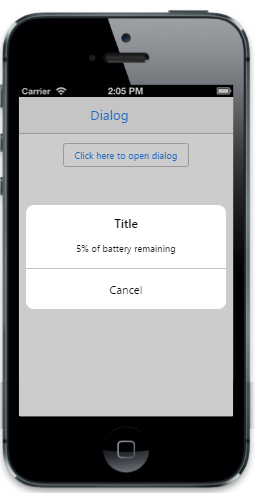
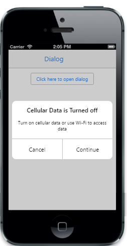

## Mode

The Mode property specifies the different types of dialog modes. The possible values are, 

1. Alert mode. 
2. Confirm mode.
3. Normal mode.
4. Full view mode.
### Alert Mode

The AlertDialog box property is used to communicate an Alert message.

@{

@Html.EJMobile().Dialog("alertdlg").Mode(DialogMode.Alert).Content(

@&lt;div&gt;

5% of battery remaining

&lt;/div&gt;)

}

&lt;div style="text-align: center"&gt;

@Html.EJMobile().Button("btn1").Text("Click here to open dialog").ClientSideEvents(evt => { evt.TouchEnd("openAlertDialog"); })

&lt;/div&gt;

[Script]

        function openAlertDialog(args)

        {

            App.activePage.find("#alertdlg").ejmDialog("open");

        }

The following screenshot displays the output.

{  | markdownify }
{:.image }

### Confirm Mode

The ConfirmDialog box property is mostly used to take the user's consent on any option. It displays a Dialog box with two buttons, Ok and Cancel. Ok button returns true and Cancel button returns false.

@{

@Html.EJMobile().Dialog("alertdlg").Title("Cellular Data is Turned off").Mode(DialogMode.Confirm).Content(

@&lt;div&gt;

Turn on cellular data or use Wi-Fi to access data

&lt;/div&gt;)

}

&lt;div style="text-align: center"&gt;

@Html.EJMobile().Button("btn1").Text("Click here to open dialog").ClientSideEvents(evt => { evt.TouchEnd("openAlertDialog"); })

&lt;/div&gt;

[Script]

        function openAlertDialog(args)

        {

            App.activePage.find("#alertdlg").ejmDialog("open");

        }

The following screenshot displays the output.

{  | markdownify }
{:.image }

### Normal Mode

The Normal Mode Dialog box property is used to display the message in sub screen area on a whole screen. It displays a Dialog box with two buttons, Continue and Cancel. Continue button returns true and Cancel button returns false. It is suitable for tablet devices.

@{

@Html.EJMobile().Dialog("alertdlg").Title("Welcome").Mode(DialogMode.Normal).Content(

@&lt;div&gt;

Syncfusion provides software components and tools for the Microsoft .NET platform.

&lt;/div&gt;)

}

&lt;div style="text-align: center"&gt;

@Html.EJMobile().Button("btn1").Text("Click here to open dialog").ClientSideEvents(evt => { evt.TouchEnd("openAlertDialog"); })

&lt;/div&gt;

[Script]

        function openAlertDialog(args)

        {

            App.activePage.find("#alertdlg").ejmDialog("open");

        }

The following screenshot displays the output.

{  | markdownify }
{:.image }

### Full View Mode

The FullViewDialog box property is used to display messages on full screen and it is suitable for mobile devices.

@{

@Html.EJMobile().Dialog("alertdlg").Title("Welcome").Mode(DialogMode.Fullview).Content(@&lt;div&gt;

Syncfusion provides software components and tools for the Microsoft .NET platform.

&lt;/div&gt;)

}

&lt;div style="text-align: center"&gt;

@Html.EJMobile().Button("btn1").Text("Click here to open dialog").ClientSideEvents(evt => { evt.TouchEnd("openAlertDialog"); })

&lt;/div&gt;

[Script]

        function openAlertDialog(args)

        {

            App.activePage.find("#alertdlg").ejmDialog("open");

        }

The following screenshot displays the output.

{  | markdownify }
{:.image }

