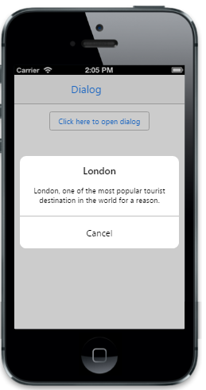

# Overlay

The EnableModal property enables the modal Dialog that blocks you from interacting with the rest of the page until it is closed. The default value is false.



@{

@Html.EJMobile().Dialog("alertdlg").Title("London").LeftButtonCaption("Cancel").EnableModal(true).Content(

@

 London, one of the most popular tourist destination in the world for a reason.

)

}

@Html.EJMobile().Button("btn1").Text("Click here to open dialog").ClientSideEvents(evt => { evt.TouchEnd("openAlertDialog"); })





        function openAlertDialog(args)

        {

            App.activePage.find("#alertdlg").ejmDialog("open");

        }



The following screenshot displays the output.

