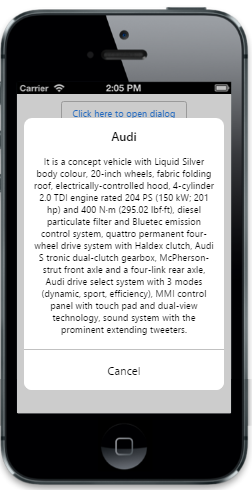

# Scrolling Settings

## Allow scrolling   

To enable  scrollingbehavior for the Dialog content. The default value is true.


        
@{

    @Html.EJMobile().Dialog("alertdlg").Title("Audi").LeftButtonCaption("Cancel").AllowScrolling(false).Content(

    @

         It is a concept vehicle with Liquid Silver body colour, 20-inch wheels, fabric folding roof, electrically-controlled hood, 4-cylinder 2.0 TDI engine rated 204 PS (150 kW; 201 hp)
         and 400 N·m (295.02 lbf·ft), diesel particulate filter and Bluetec emission control system, quattro permanent four-wheel drive system with Haldex clutch,
         Audi S tronic dual-clutch gearbox, McPherson-strut front axle and a four-link rear axle, Audi drive select system with 3 modes (dynamic, sport, efficiency),
         MMI control panel with touch pad and dual-view technology, sound system with the prominent extending tweeters.
    
)

}

    @Html.EJMobile().Button("btn1").Text("Click here to open dialog").ClientSideEvents(evt => { evt.TouchEnd("openAlertDialog"); })

         

         
        

        function openAlertDialog(args)

        {

            App.activePage.find("#alertdlg").ejmDialog("open");

        }



The following screenshot displays the output.

## EnableNativeScrolling

 To enable native (built-in browser) scrolling functionality of the devices when scrolling is allowed. The default value is false.



        @Html.EJMobile().NavigationBar("header").Title("Dialog")

        

            @{

                @Html.EJMobile().Dialog("alertdlg").Title("Audi").LeftButtonCaption("Cancel").AllowScrolling(true).EnableNativeScrolling(true).Content(

                @

                    It is a concept vehicle with Liquid Silver body colour, 20-inch wheels, fabric folding roof, electrically-controlled hood, 4-cylinder 2.0 TDI engine rated 204 PS (150 kW; 201 hp)
                    and 400 N·m (295.02 lbf·ft), diesel particulate filter and Bluetec emission control system, quattro permanent four-wheel drive system with Haldex clutch,
                    Audi S tronic dual-clutch gearbox, McPherson-strut front axle and a four-link rear axle, Audi drive select system with 3 modes (dynamic, sport, efficiency),
                    MMI control panel with touch pad and dual-view technology, sound system with the prominent extending tweeters.
                
)

            }

            

                @Html.EJMobile().Button("btn1").Text("Click here to open dialog").ClientSideEvents(evt => { evt.TouchEnd("openAlertDialog"); })

            





        function openAlertDialog(args)

        {

            App.activePage.find("#alertdlg").ejmDialog("open");

        }



The following screenshot displays the output.

