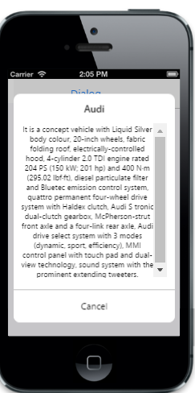

# Scrolling Settings

## AllowScrolling   

The AllowScrolling property is used to enable scrollingbehavior for the Dialog content. The default value is true.


@{

@Html.EJMobile().Dialog("alertdlg").Title("Welcome to Syncfusion").LeftButtonCaption("Cancel").AllowScrolling(false).Content(

@

         Syncfusion provides software components and tools for the Microsoft .NET    

         platform.Inc.a developer solutions company, announced the release of Essential 

         Studio Enterprise Edition 2014, Volume 1, and the first major update to its  

         components in 2014. In response to the increasing use of JavaScript in line- 

         of-business applications, this release features dozens of new JavaScript tools    

         and numerous updates to its current lineup.At the forefront of Volume 1 are 27 

         new JavaScript libraries designed specifically for mobile development.

)

}

@Html.EJMobile().Button("btn1").Text("Click here to open dialog").ClientSideEvents(evt => { evt.TouchEnd("openAlertDialog"); })




[Script]

        function openAlertDialog(args)

        {

            App.activePage.find("#alertdlg").ejmDialog("open");

        }


The following screenshot displays the output.

## CheckDOMChanges                      

The CheckDOMChanges property is used to refresh the scroll panel rendered in the control when elements are added dynamically. The default value is false.


@{

@Html.EJMobile().Dialog("alertdlg").Title("Welcome to Syncfusion").LeftButtonCaption("Cancel").CheckDOMChanges(true).Content(

@

Syncfusion provides software components and tools for the Microsoft .NET platform

)

}

@Html.EJMobile().Button("btn1").Text("Click here to open dialog").ClientSideEvents(evt => { evt.TouchEnd("openAlertDialog"); })




[Script]

        function openAlertDialog(args)

        {

            App.activePage.find("#alertdlg").ejmDialog("open");

        }



The following screenshot displays the output.

## EnableNativeScrolling

The EnableNativeScrolling property is used to enable native (built-in browser) scrolling functionality of the devices when scrolling is allowed. The default value is false.


@{

@Html.EJMobile().Dialog("alertdlg").Title("Welcome to Syncfusion").LeftButtonCaption("Cancel").EnableNativeScrolling(true).Content(

@

 Syncfusion, Inc.a developer solutions company, announced the release of Essential Studio Enterprise Edition 2014, Volume 1, the first major update to its components in 2014. In response to the increasing use of JavaScript in line-of-business applications, this release features dozens of new JavaScript tools and numerous updates to its current lineup.At the forefront of Volume 1 are 27 new JavaScript libraries designed specifically for mobile development. They provide solutions for a variety of development requirements, including specialized tools for navigation and data visualization. All are compatible with the popular Knockout JavaScript library, allowing them to work seamlessly with current development projects. Windows, Android, and iOS themes are built into every library to emulate the appearance of native apps.

)

}

@Html.EJMobile().Button("btn1").Text("Click here to open dialog").ClientSideEvents(evt => { evt.TouchEnd("openAlertDialog"); })




[Script]

        function openAlertDialog(args)

        {

            App.activePage.find("#alertdlg").ejmDialog("open");

        }


The following screenshot displays the output.

