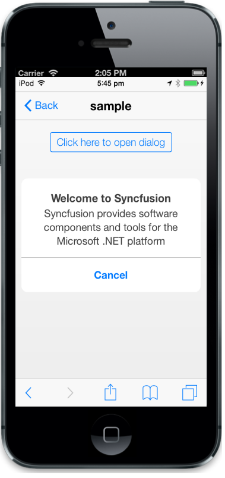

## Target Height

The TargetHeight property specifies the target height of the Dialog.

@{

@Html.EJMobile().Dialog("alertdlg").Title("Welcome to Syncfusion").LeftButtonCaption("Cancel").TargetHeight(500).Content(

@

Syncfusion provides software components and tools for the Microsoft .NET platform

)

}

@Html.EJMobile().Button("btn1").Text("Click here to open dialog").ClientSideEvents(evt => { evt.TouchEnd("openAlertDialog"); })

[Script]

        function openAlertDialog(args)

        {

            App.activePage.find("#alertdlg").ejmDialog("open");

        }

The following screenshot displays the output.

{{ '' | markdownify }}
{:.image }

