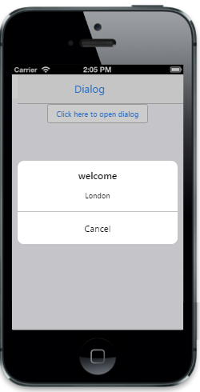

# Templating                                  

To define the ID of the template element where you can specify the content to render in the Dialog.



@{

    @Html.EJMobile().Dialog("alertdlg").Title("Welcome").LeftButtonCaption("Cancel").TemplateId("temp").Content(

    @

  
).Content(@
London, one of the most popular tourist destination in the world for a reason.
)

}

@Html.EJMobile().Button("btn1").Text("Click here to open dialog").ClientSideEvents(evt => { evt.TouchEnd("openAlertDialog"); })





        function openAlertDialog(args)

        {

            App.activePage.find("#alertdlg").ejmDialog("open");

        }



The following screenshot displays the output.

