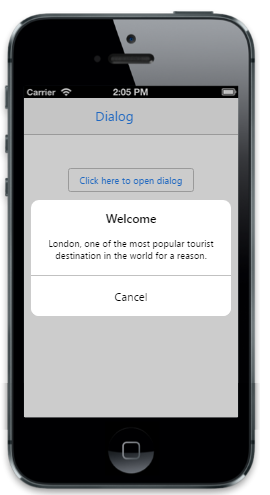

## Templating                                  

The TemplateId property is used to define the ID of the template element where you can specify the content to render in the Dialog.

@{

@Html.EJMobile().Dialog("alertdlg").Title("Welcome to Syncfusion").LeftButtonCaption("Cancel").TemplateId("temp").Content(

@&lt;div&gt;

Syncfusion provides software components and tools for the Microsoft .NET platform

&lt;/div&gt;).Content(@
Syncfusion Software
)

}

&lt;div style="text-align: center"&gt;

@Html.EJMobile().Button("btn1").Text("Click here to open dialog").ClientSideEvents(evt => { evt.TouchEnd("openAlertDialog"); })

&lt;/div&gt;

[Script]

        function openAlertDialog(args)

        {

            App.activePage.find("#alertdlg").ejmDialog("open");

        }

The following screenshot displays the output.

{  | markdownify }
{:.image }

