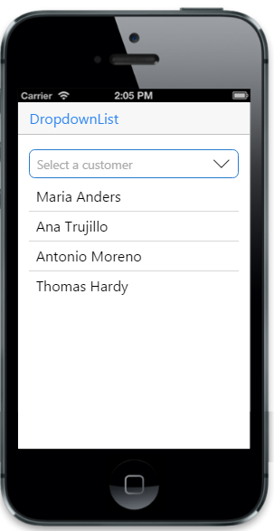

# Data Binding

## Local data binding

Essential Studio mobile JS DropDownList provides support for Data Binding.Elements can be bounded to data from a variety of data sources. In local Data Binding, the data source is written inside the program. Then it is handled by the DropDownList Datasource property is used to get the data source that holds the list items.

For MVC Wrapper sample, create a model file for Data Binding. Add the following model code to a CS file and save it as ListLocalData.cs.


public class ListLocalData
{
public string name { get; set; }
}
    public static class ListLocalDataModal
    {
        public static List<ListLocalData> listSource = new List<ListLocalData>();
        public static List<ListLocalData> setListSource()
        {
            listSource.Add(new ListLocalData { name = "Australia" });
            listSource.Add(new ListLocalData { name = "Brazil" });
            listSource.Add(new ListLocalData { name = "China"});
            listSource.Add(new ListLocalData { name = "India"});
            listSource.Add(new ListLocalData { name = "Spain"});
            return listSource;
        }
        public static void clearSource()
        {
            listSource.Clear();
        }
    }  




@model List<ListLocalData>

    @Html.EJMobile().DropDownList("dd_grouping").DataSource(Model).Fields(field => field.Text("name")).WaterMarkText("Select a Country")
    


The following screenshot displays the Local Data Binding:

## Remote data binding

In Remote Data Binding, the data is retrieved from a particular URL unlike the local Data Binding and then it is handled by the DropDownList control. Datasource is used to get the data that holds the list items.



  @Html.EJMobile().DropDownList("list").DataSource(d => d.URL("http://mvc.syncfusion.com/Services/Northwnd.svc/Customers")).Fields(field => field.Text("ContactName")).WaterMarkText("Select a Customer")



The following screenshot displays the remote Data Binding:

