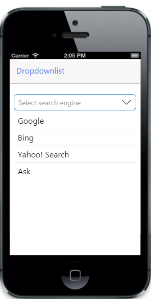
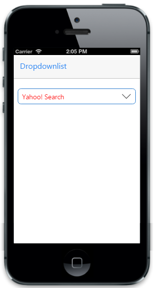

# Getting starting

This section explains briefly about how to create a dropdownlist in your mobile  ASP.NET MVC application 
Essential JavaScript dropdownlist provides support for multiple selections, within your web page and allows you to specify an option from the list. 
The following screenshot demonstrates the functionality with dropdownlist action.

## Create basic mobile layout

Create a simple MVC application and paste the following header and scrollpanel layout page content inside the <body>tag of layout.cshtml. You can create a MVC Project and add necessary Dll’s and Scripts with the help of the [MVC Getting Started Documentation](https://help.syncfusion.com/aspnetmvc/getting-started).



  @Html.EJMobile().NavigationBar("header").Title("Dropdownlist")
  
  

            

                <!--Dropdownlist  control-->

            

        

        <!--Scroll Panel-->
        @Html.EJMobile().Scrollpanel("acc").Target("dropdownlist")



## Create DropDownList control

To Create DropDownList control, specify ejmdropdownlist as data-role attribute for a &#60;input&#62; element. You can set the text for list items by using data-ej-text attribute.



    

              @Html.EJMobile().DropDownList("list").WaterMarkText("Select search engine")
    

   
   <!--Adding list of Options -->
   


Run the above code to render the following output.

## Add list of options

Specifies the Targetid attribute for  target element which consists the list of options to render DropDownList. 



                <!--Dropdownlist  control-->
                @Html.EJMobile().DropDownList("list").WaterMarkText("Select search engine").TargetId("targetEle")
                <!--Adding list of options -->
                <ul id="targetEle">
                    <li data-ej-text="Google"></li>
                    <li data-ej-text="Bing"></li>
                    <li data-ej-text="Yahoo! Search"></li>
                    <li data-ej-text="Ask"></li>
                    <li data-ej-text="Aol Search"></li>
                    <li data-ej-text="Wow"></li>
                    <li data-ej-text="WebCrawler"></li>
                    <li data-ej-text="MyWebSearch"></li>
                    <li data-ej-text="Infospace"></li>
                    <li data-ej-text="DuckDuckGo"></li>
                    <li data-ej-text="Blekko"></li>
                    <li data-ej-text="Contenko"></li>
                </ul>



Run the above code to render the following output.

## Css class

Sets the root class for DropDownList. This cssClass API helps to use custom skinning option for DropDownList control. By defining the root class using this API, we need to include this root class in CSS.



                @Html.EJMobile().DropDownList("list").WaterMarkText("Select search engine").TargetId("targetEle").CssClass("customclass")
                <!--Adding list of options -->
                <ul id="targetEle">
                    <li data-ej-text="Google"></li>
                    <li data-ej-text="Bing"></li>
                    <li data-ej-text="Yahoo! Search"></li>
                    <li data-ej-text="Ask"></li>
                    <li data-ej-text="Aol Search"></li>
                    <li data-ej-text="Wow"></li>
                    <li data-ej-text="WebCrawler"></li>
                    <li data-ej-text="MyWebSearch"></li>
                    <li data-ej-text="Infospace"></li>
                    <li data-ej-text="DuckDuckGo"></li>
                    <li data-ej-text="Blekko"></li>
                    <li data-ej-text="Contenko"></li>
                </ul>



Run the above code to render the following output.

