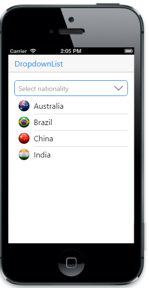

## Image support

You can add images to your DropDownList items by specifying the image class name for individual items using ‘data-ej-fields-image’ attribute.



 @model List<YearData>
  
    @Html.EJMobile().DropDownList("dd_grouping").DataSource(Model).Fields(field => field.Text("name").Image("image")).WaterMarkText("Select nationality")



For MVC Wrapper sample, create a model file for Data Binding. Add the following model code to a CS file and save it as yearData.cs.



 public class YearData
    {
        public string name { get; set; }
        public string image { get; set; }
    }
    public static class YearsModel
    {
        public static List<YearData> years = new List<YearData>();
        public static List<YearData> setYears()
        {
            years.Add(new YearData { name = "Australia", image = "../../themes/sample/autocomplete/Australia.png" });
            years.Add(new YearData { name = "Brazil", image = "../../themes/sample/autocomplete/Brazil.png" });
            years.Add(new YearData { name = "China", image = "../../themes/sample/autocomplete/China.png" });
            years.Add(new YearData { name = "India", image = "../../themes/sample/autocomplete/India.png" });
            years.Add(new YearData { name = "Spain", image = "../../themes/sample/autocomplete/Spain.png" });
            years.Add(new YearData { name = "United States of America", image = "../../themes/sample/autocomplete/USA.png" });

            return years;
        }
        public static void clearSource()
        {
            years.Clear();
        }
    }


The following screenshot displays the image support

