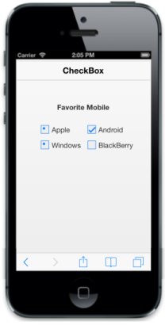

# CheckState

This property enables you to specify the check state of the control by setting EnableTristate to “true”. By default, this property is set to true.

The possible values are:

1. Check
2. Uncheck
3. Indeterminate

Refer to the following code examples.


@Html.EJMobile().Header("sample_header").Title("CheckBox")

    

        <b>Favorite Mobile</b>

    

     

    <table border="0" cellpadding="6">

        <tr>

            <td width="100px">

                @Html.EJMobile().CheckBox("apple").Text("Apple").EnableTriState(true).CheckState(CheckState.Indeterminate)

            </td>

            <td width="100px">

                @Html.EJMobile().CheckBox("android").Text("Android").EnableTriState(true).CheckState(CheckState.Check)

            </td>

        </tr>

        <tr>

            <td width="100px">

                @Html.EJMobile().CheckBox("windows").Text("Windows").EnableTriState(true).CheckState(CheckState.Indeterminate)

            </td>

            <td width="100px">

                @Html.EJMobile().CheckBox("Bberry").Text("BlackBerry")

            </td>

        </tr>

    </table>



Execute the above code examples to render the following output.

