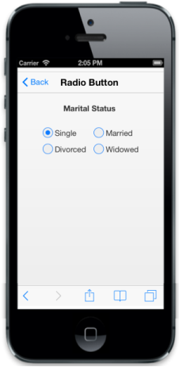

# Checked 

This is a Boolean property that lets you choose whether RadioButton needs to be selected by default or not. By default, this property is set to false.

     

    

        

            

                <b>Marital Status</b>

            

        

         

        <table>

            <tr>

                <td width="100px">

                    @Html.EJMobile().RadioButton("sample_radiobutton", "").Text("Single").Checked(true)

                </td>

                <td width="100px">

                    @Html.EJMobile().RadioButton("sample_radiobutton", "").Text("Married ")

                </td>

            </tr>

            <tr>

                <td width="100px">

                    @Html.EJMobile().RadioButton("sample_radiobutton", "").Text("Divorced")

                </td>

                <td width="100px">

                    @Html.EJMobile().RadioButton("sample_radiobutton", "").Text("Widowed")

                </td>

            </tr>

        </table>

    

The following screenshot displays checked status:

{{ '' | markdownify }}
{:.image }

