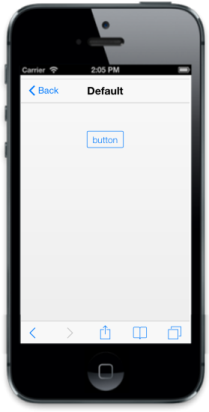

# Customize ContentType and Text

ContentType

You can make the Button appear as an image or text or combination of both. This property allows you to choose the ContentType of the Button in your application. By default, the ContentType of Button is set to ‘text’.

The possible values are

* Text
* Image
* Both

You can refer to the following code examples.

@Html.EJMobile().Button("sample_button").Text("button").ContentType(ButtonContentType.Text)

{{ '' | markdownify }}
{:.image }

Text

This property allows you to specify the text to be appeared inside the Button using ‘Text’ property. 

You can refer to the following code examples.

           @Html.EJMobile().Button("sample_button").Text("button")

{{ '' | markdownify }}
{:.image }

