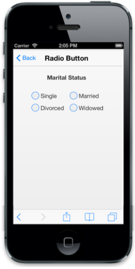

# Customize Label

The Text property lets you set labels for the RadioButton. To set the text for the RadioButton, you can refer the following code example.



     

    

        

            

                <b>Marital Status</b>

            

        

         

        <table>

            <tr>

                <td width="100px">

                    @Html.EJMobile().RadioButton("sample_radiobutton", "").Text("Single")                </td>

                <td width="100px">

                    @Html.EJMobile().RadioButton("sample_radiobutton", "").Text("Married")

                </td>

            </tr>

            <tr>

                <td width="100px">

                    @Html.EJMobile().RadioButton("sample_radiobutton", "").Text("Divorced")

                </td>

                <td width="100px">

                    @Html.EJMobile().RadioButton("sample_radiobutton", "").Text("Widowed")

                </td>

            </tr>

        </table>

    



The following screenshot displays customized labels:

