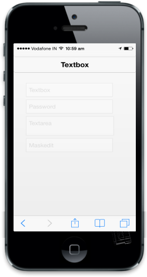

# Enable and Disable

Enabled property is used to enable or disable your Textbox control. The default value is true.

Refer to the following code example.

    @Html.EJMobile().TextBox("textbox_sample").WatermarkText("Textbox").Enabled(false)

    @Html.EJMobile().PassWord("textbox_sample").WatermarkText("password").Enabled(false)

    @Html.EJMobile().TextArea("textbox_sample").WatermarkText("Textarea").Enabled(false)

    @Html.EJMobile().MaskEdit("textbox_sample").WatermarkText("maskedit").Mask("+1 (999) 999-999").Enabled(false)

{  | markdownify }
{:.image }

