# Getting Started

In this section you can learn how to create FormControls in mobile app.

## Create your first Form in MVC

The ASP.NET MVC provides a way to create a Form with the following mobile widgets.

1. Textbox 
2. Numeric Textbox
3. Radiobutton 
4. Checkbox 
5. Button

From the following guidelines, you can create a BillPaymentApp where you can learn its features in the above mentioned widgets.

{ 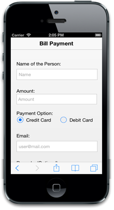 | markdownify }
{:.image }
{ 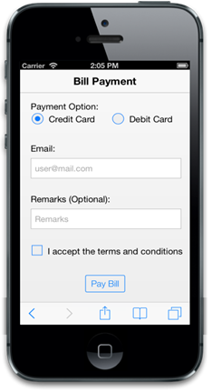 | markdownify }
{:.image }

Create the necessary layout 

In the BillPaymentApp, you can use the Textbox control to get the Name of the Person, Email, and Remarks, NumericTextbox control for the Amount field, Radio button for the Payment options, Check box for the terms and conditions, and Button control to submit the form.

Create a simple MVC application and add the following header and scrollpanel layout page content inside the &lt;body&gt; tag of layout.cshtml. 

1. Create an MVC Project and add necessary Dll’s and Scripts with help of the [MVC-Getting Started Documentation](http://help.syncfusion.com/ug/js/default.htm) for mobile.

     &lt;!--Header Control--&gt;

     @Html.EJMobile().Header("header").Title("Bill Payment")

      &lt;div id="form_sample" class="sample"&gt;

         &lt;div&gt;

                @RenderBody()

          &lt;/div&gt;

      &lt;/div&gt;

      &lt;!--Scroll Panel--&gt;

      @Html.EJMobile().Scrollpanel("form_controls").Target("form_sample")

2. Add the following Layout code to the corresponding view page.

       &lt;!--Add the Form Elements--&gt;   

                &lt;form id="form1"&gt;

                    &lt;br /&gt;

                    &lt;label&gt;

                        Name of the Person:

                    &lt;/label&gt;

                    &lt;div&gt;

                        &lt;!--Add user name Text box Here--&gt;

                    &lt;/div&gt;

                    &lt;br /&gt;

                    &lt;label&gt;

                        Amount:

                    &lt;/label&gt;

                    &lt;div&gt;

                        &lt;!--Add numeric text box for amount here--&gt;

                    &lt;/div&gt;

                    &lt;br /&gt;

                    &lt;div&gt;

                        &lt;label&gt;

                            Payment Option:

                        &lt;/label&gt;

                    &lt;/div&gt;

                    &lt;div&gt;

                        &lt;table class="radio"&gt;

                            &lt;tr&gt;

                                &lt;td&gt;

                                    &lt;!--radio button for credit --&gt;

                                &lt;/td&gt;

                                &lt;td&gt;

                                    &lt;!--radio button for debit--&gt;

                                &lt;/td&gt;

                            &lt;/tr&gt;

                        &lt;/table&gt;

                    &lt;/div&gt;

                    &lt;br /&gt;

                    &lt;div&gt;

                        &lt;label&gt;

                            Email:

                        &lt;/label&gt;

                        &lt;div&gt;

                            &lt;!--Add email text box here--&gt;

                        &lt;/div&gt;

                        &lt;br /&gt;

                    &lt;/div&gt;

                    &lt;div&gt;

                        &lt;label&gt;

                            Remarks (Optional):

                        &lt;/label&gt;

                        &lt;div&gt;

                            &lt;!--Add remark text box here--&gt;

                        &lt;/div&gt;

                        &lt;br /&gt;

                    &lt;/div&gt;

                    &lt;div&gt;

                        &lt;table class="check"&gt;

                            &lt;tr&gt;

                                &lt;td&gt;

                                    &lt;!--Add check box here--&gt;

                                &lt;/td&gt;

                            &lt;/tr&gt;

                        &lt;/table&gt;

                    &lt;/div&gt;

                    &lt;br /&gt;

                    &lt;div align="center" class="submitbutton"&gt;

                        &lt;!--Add submit button here--&gt;

                    &lt;/div&gt;

                &lt;/form&gt;

 &lt;!--Add Dialog Control for Payment Status--&gt;

 @Html.EJMobile().Dialog("info_msg").Title("Alert").LeftButtonCaption("ok").EnableModal(true).EnableAutoOpen(false).Content(@&lt;div id="dlgcontent"&gt;&lt;/div&gt;).ClientSideEvents(evt => evt.ButtonTap("exit"))

3. Add the following styles.

      &lt;style&gt;

        .appview .submitbutton {

        text-align: center;

    }

    .appview .chksample {

        display: inline-block;

    }

    .appview #form_sample label.error {

        color: #FF0000;

    }

    .check td, .radio td {

        min-width: 150px;

    }

    .e-m-ios7 label, .e-m-ios7 .check, .e-m-ios7 .radio {

        padding-left: 10px;

    }

    .e-m-windows label, .e-m-windows .check {

        padding-left: 20px;

    }

    .e-m-windows .radio {

        padding-left: 20px;

    }

    .radio {

        padding-top: 5px;

    }

    .e-m-android #form_sample, .e-m-ios7 #form_sample {

        padding: 10px;

    }

    .e-m-android #form1 {

        padding: 0px 10px;

    }

    .e-m-windows #form_sample {

        padding: 3px;

    }      

&lt;/style&gt;

Add Textbox Control

TextboxControl is required to get the Name of the Person. To render this control, you can add the following Layout code to the corresponding view page.

 &lt;!—Textbox for Name of the Person--&gt;

             @Html.EJMobile().TextBox("user_name")

                &lt;label for="user_name" class="error" generated="true" /&gt;

Run the above code to render the following output. 

{ 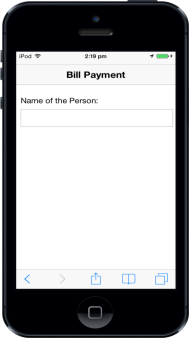 | markdownify }
{:.image }

Set Watermark text

The WatermarkText specifies a short hint that describes the expected value of the input field. This is achieved using the WatermarkText property. The following code example shows you how to set Watermarktext.

      &lt;!--Textbox--&gt;

      @Html.EJMobile().TextBox("user_name").WatermarkText("Name")

{ 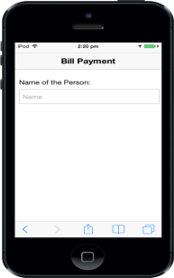 | markdownify }
{:.image }

Add Numeric Textbox Control

To render the NumericTextbox control, you can refer the following code example. 

&lt;!--Numeric Textbox--&gt;

        @Html.EJMobile().NumericTextbox("amount").WatermarkText("Amount")

                &lt;label for="amount" class="error" generated="true" /&gt;

{ 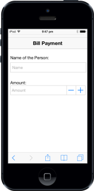 | markdownify }
{:.image }

Disable Spin Button 

By default, the SpinButton is visible. Using this, you can increment or decrement the values. In the BillPaymentApp, SpinButton is not required. To hide this, you can set ShowSpinButton property to false.

       &lt;!--Numeric Textbox--&gt;

       @Html.EJMobile().NumericTextbox("amt").WatermarkText("Amount")

       .ShowSpinButton(false)

{ 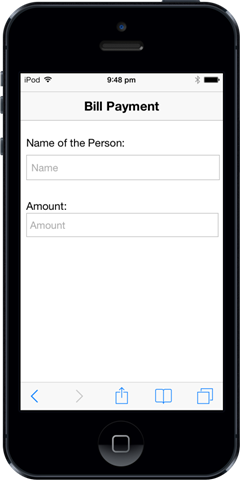 | markdownify }
{:.image }

Set Decimal Point 

By default, decimal numbers (floating point) are not allowed. In this case, you need to allow the decimal values since it is an amount field. To achieve this, you can set DecimalPlaces property with a numeric value that specifies the number of decimals allowed.

        &lt;!--Numeric Textbox--&gt;

        @Html.EJMobile().NumericTextbox("amt").WatermarkText("Amount")

         .ShowSpinButton(false).DecimalPlaces(2)

Add Radio Button Control

A RadioButton control is required for the payment option (credit or debit). By using Text property you can add the text for radio button. To render this control, add the following code example.

       &lt;!--Radio Button for Credit--&gt;

@Html.EJMobile().RadioButton("radbtn", "credit", new { id = "credit" }).Text("Credit Card").Checked(true) 

       &lt;!--Radio Button for Debit--&gt;

@Html.EJMobile().RadioButton("radbtn", "debit", new { id = "debit" }).Text("Debit Card")

Add Textbox for E-Mail

You can add Textbox for E-mail.

&lt;!--Textbox for E-mail--&gt;

@Html.EJMobile().TextBox("mail").WatermarkText("user@mail.com")

&lt;label for="mail" class="error" generated="true" /&gt;

{ 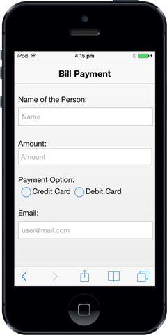 | markdownify }
{:.image }

Add Textbox for Remarks

You can add Textbox for Remarks.

         &lt;!--Textbox--&gt;

 @Html.EJMobile().TextBox("remarks").WatermarkText("Remarks")

{  | markdownify }
{:.image }

Add Checkbox Control

You can use Checkbox Control for “agree the terms and conditions” option. By using Text property, you can add the text to the checkbox control. To render this, add the following code example.

    &lt;!--Checkbox--&gt;

@Html.EJMobile().CheckBox("chkbox").Text("I accept the terms and conditions")

{ 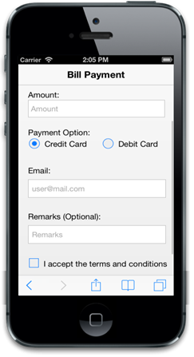 | markdownify }
{:.image }

Add Button Control

ButtonControl is required to submit the Form. By using client side events, you can perform form validation. Here TouchEnd event is used to perform the validation. To render this control, you need to add the following code example and also add the Text property to specify the Button text. 

 &lt;!--Button--&gt;

@Html.EJMobile().Button("btn").Text("Pay Bill").ClientSideEvents(evt => evt.TouchEnd("formsubmit"))

{ 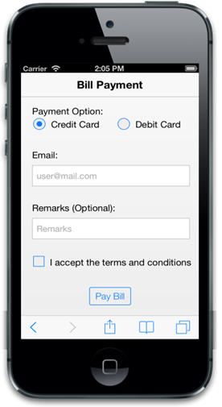 | markdownify }
{:.image }

Form Validation

You have created the Billpayment with required controls and for Validation you can use ASP.NET MVCMobileDialog control to show the Status of your payment.

&lt;script type="text/javascript"&gt;

    //$(function () {

    //    $("#btn").attr("name", "btn");

    //});

    function formsubmit(event) {

        validation();

        $("#form1").submit();

        $("#form_controls").ejmScrollPanel("refresh");

    }

    function exit() {

        var dialogObject = $("#info_msg").data("ejmDialog"); // creating instance for dialog

        dialogObject.close(); // close dialog

        $(".e-m-text-input").val("");

        $(".e-m-editor-input").val("");

        $("#chkbox").ejmCheckBox("model.checked", false);

    }

    function validation() {

        validator = $("#form1").validate({

            debug: true,

            rules: {

                user_name: { required: true },

                amount: { required: true, number: true },

                mail: { required: true, email: true }

            },

            messages: {

                user_name: { required: "Please enter user name" },

                amount: { required: "Please enter amount" },

                mail: { required: "Please enter e-mail" }

            },

            submitHandler: function (form) {

                var dialogObject = $("#info_msg").data("ejmDialog"); // creating instance for dialog

                if (!$("#chkbox").ejmCheckBox("isChecked")) {

                    dialogObject.open(); // open dialog

                    $("#dlgcontent").text("Could you please agree our terms and conditions ?");

                }

                else {

                    dialogObject.open();

                    $("#dlgcontent").text("Your payment is received successfully");

                }

            }

        });

    }

&lt;/script&gt;

{ 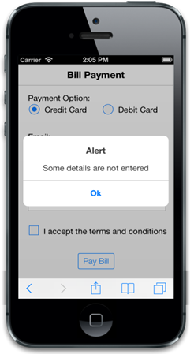 | markdownify }
{:.image }
{ 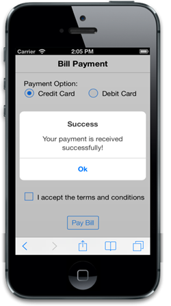 | markdownify }
{:.image }

