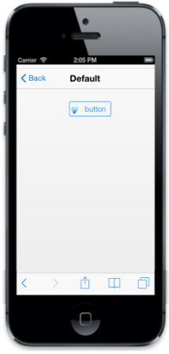

# Image Support

ImageClass

In your application, you can include image inside the Button. In that case, you can use ImageClass for Button control where you can specify the image to be displayed in the Button. Ensure that you need to set the ContentType to ‘Image’. 

You can refer the following code examples.

    <!--In head section-->

    <!--In body section-->

@Html.EJMobile().Button("sample_button").ContentType(ButtonContentType.Image).ImageClass("image")

{{ '' | markdownify }}
{:.image }

ImagePosition

You can also set the position of the image in the Button. ImagePosition property allows you to specify the position of the image in your Button control. You can set the position of the image in the Button either after the text or before text by setting the image position to ‘rRght’ or ‘Left’ respectively.

By default this property is set to ‘Left’.

You can refer to the following code examples.

@Html.EJMobile().Button("sample_button").ContentType(ButtonContentType.Both).ImageClass("image").Text("button").ImagePosition(ButtonImagePosition.Left)

{{ '' | markdownify }}
{:.image }

