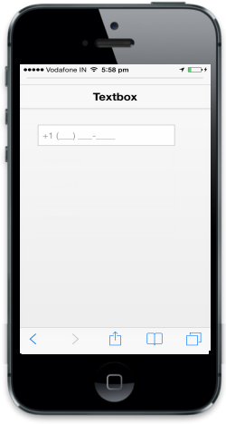

# Masking

It can be done using Mask EditTextbox control. When you define an input mask using the Mask property, each character position in the Mask Edit control maps to either a placeholder of a specified type or a literal character.

Refer to the following code example.

@Html.EJMobile().MaskEdit("textbox_sample").WatermarkText("Maskedit").Mask("+1 (999) 999-999")  

{{ '' | markdownify }}
{:.image }

