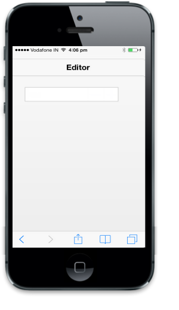

# Spin buttons

ShowSpinButton property is used to specify whether the Spin Button is visible or hidden. By clicking these buttons, you can increment or decrement the Numeric value.

@Html.EJMobile().NumericTextbox("textbox_sample").ShowSpinButton(false)

The following screenshot displays the output.

{  | markdownify }
{:.image }

