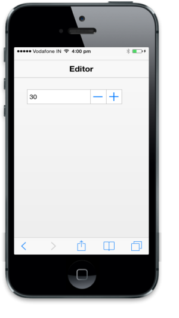

# Strict Mode

EnableStrictMode property makes Textbox accept only a value between the defined maximum and minimum values when it is set to true.

@Html.EJMobile().NumericTextbox("textbox_sample").MinimumValue(30).MaximumValue(100).EnableStrictMode(true)

The following screenshot displays the output.

{  | markdownify }
{:.image }

