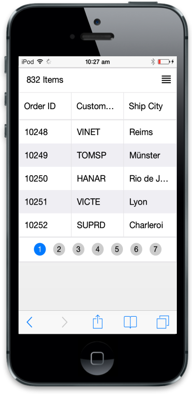
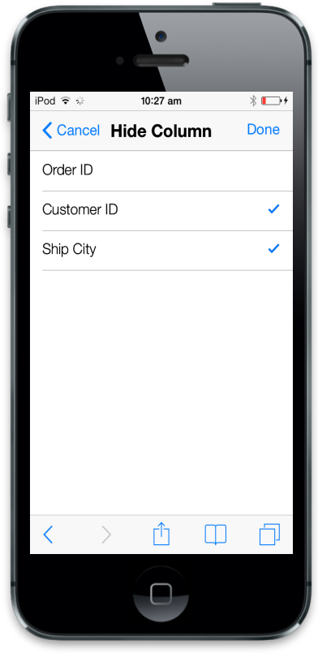
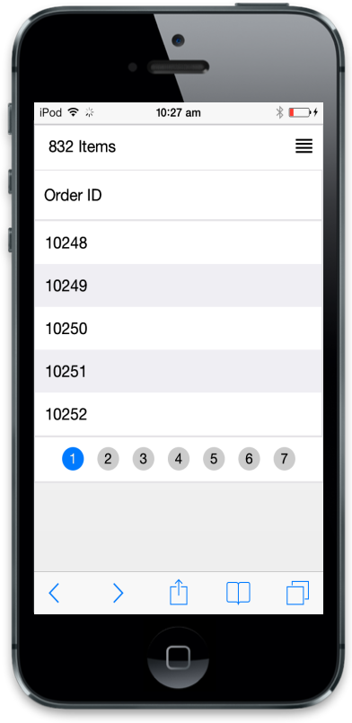

# Column Selection

By enabling “AllowColumnSelector”, you can hide the columns dynamically whenever needed. This feature is mostly useful when the available device width is not enough to display all the necessary columns. 



@(Html.EJMobile().Grid<object>("MobileGrid")

.Datasource(d=>d.URL("http://mvc.syncfusion.com/Services/Northwnd.svc/Orders/"))

.AllowPaging(true)
.AllowColumnSelector(true)

.Columns(col =>

{

col.Field("OrderID").HeaderText("Order ID").Add();

col.Field("CustomerID").HeaderText("Customer ID").Add();

col.Field("ShipCity").HeaderText("Ship City").Add();

}))



Execute the above code to render the following output.

