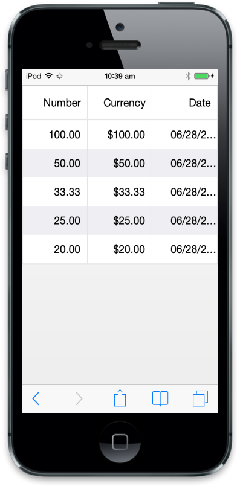
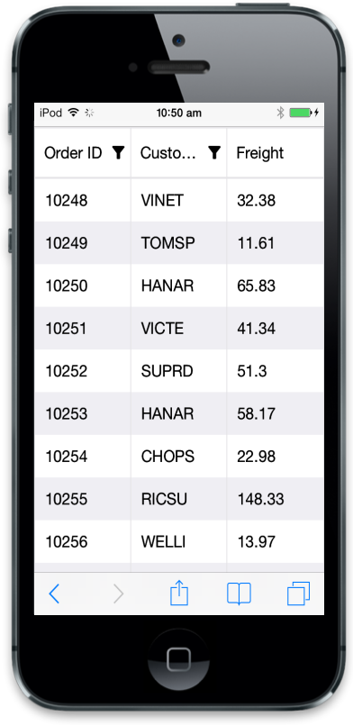
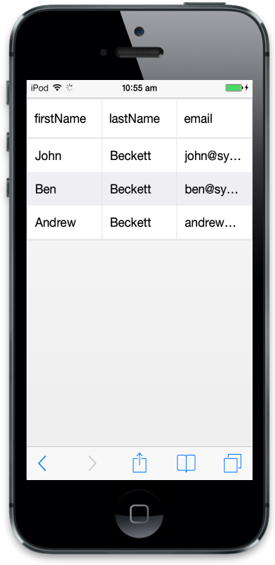

# Columns

Colums is a key feature in Grid to define schema in control based on datasource. It is useful to map field to datasource values.

## Formatting

Formatting is used to convert data values to human readable formats using specific culture settings. In Mobil Grid, you can use format property to format particular columns, for more refrence about globalize.js you can refer the link ([https://github.com/jquery/globalize](https://github.com/jquery/globalize)). Refer the following code to use formatting in Grid.




@(Html.EJMobile().Grid<object>("MobileGrid")

// the datasource gets data

.Datasource((IEnumerable<object>)ViewBag.dataSource)

.Columns(col =>

{

// the formatting columns

col.Field("Number").HeaderText("Number").Format("{0:n2}").Add();

col.Field("Currency").HeaderText("currency").Format("{0:C2}").Add();

col.Field("Date").HeaderText("Date").Format("{0:MM/dd/yyyy}").Add();

})

)





namespace MVCSampleBrowser.Controllers

{

public class ColumnFormattingData

{

public Int32 Number { get; set; }

public Int32 Currency { get; set; }

public DateTime Date { get; set; }

}

public ActionResult GridView()

{

List<ColumnFormattingData> data = new List<ColumnFormattingData>();

for (var i = 1; i < 6; i++)

{

data.Add(new ColumnFormattingData()

{

Number = 100 / i,

Currency = 100 / i,

Date = DateTime.Now

});

}

ViewBag.dataSource = data;

return View();

}
}




Execute the above code to render the following output.

## Controlling Mobile Grid actions

In ejmGrid, you can use AllowSorting and AllowFiltering to control Mobile Grid actions. Refer the following code to disable particular column. In the following example, sorting action is controlled in”CustomerID” column and filtering in “Freight” column.



@(Html.EJMobile().Grid<object>("MobileGrid")

.Datasource(d => d.URL("http://mvc.syncfusion.com/Services/Northwnd.svc/Orders/").Offline(true))

.Columns(col =>

{

col.Field("OrderID").HeaderText("Order ID").Add();

col.Field("CustomerID").HeaderText("Customer ID").AllowSorting(false).Add();

col.Field("Freight").HeaderText("Freight").AllowFiltering(false).Add();

})

.AllowSorting(true)

.AllowFiltering(true))



Execute the above code to render the following output.

## Auto-generate column

The Columns are automatically generated from the datasource and you no need to specify column declarations. Refer the following code to auto generate column behavior with Grid.




@(Html.EJMobile().Grid<object>("MobileGrid")

.Datasource((IEnumerable<object>)ViewBag.datasource))
		




namespace MVCSampleBrowser.Controllers.Grid

{

public class GridController : ApplicationController

{

public class Person

{

public string FirstName { get; set; }

public string LastName { get; set; }

public string Email { get; set; }

}

public ActionResult Default()

{

List<Person> Persons = new List<Person>();

Persons.Add(new Person() { FirstName = "John", LastName = "Beckett", Email = "john@syncfusion.com" });

Persons.Add(new Person() { FirstName = "Ben", LastName = "Beckett", Email = "ben@syncfusion.com" });

Persons.Add(new Person() { FirstName = "Andrew", LastName = "Beckett", Email = "andrew@syncfusion.com" });

ViewBag.datasource = Persons;

return View();

}

}

}




Execute the above code to render Auto-generate columns.

