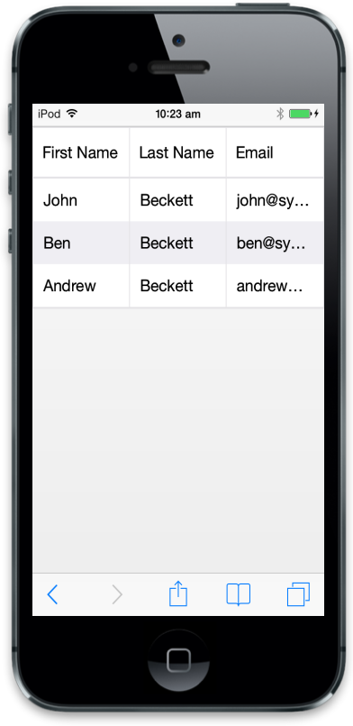
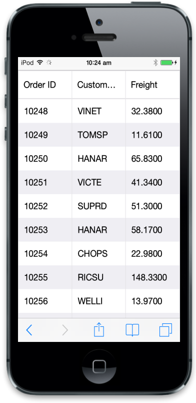
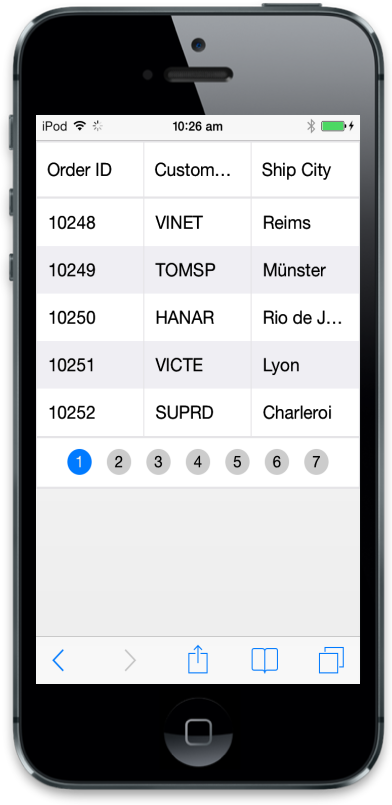
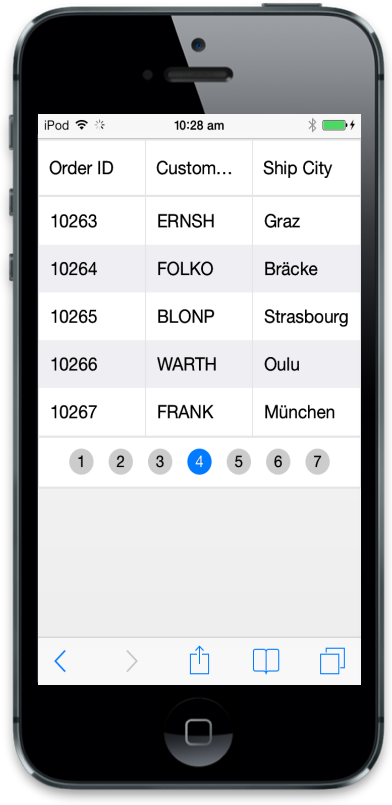
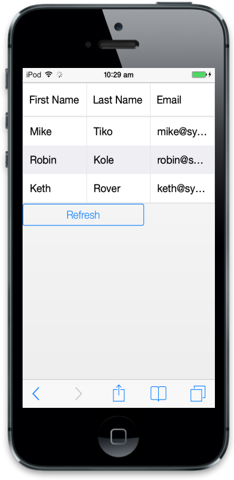
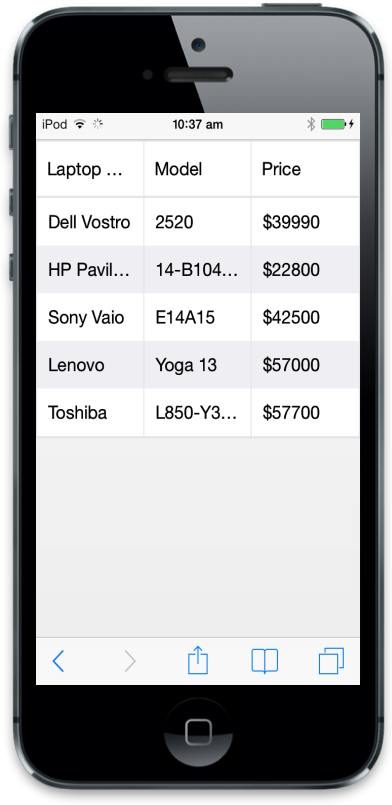
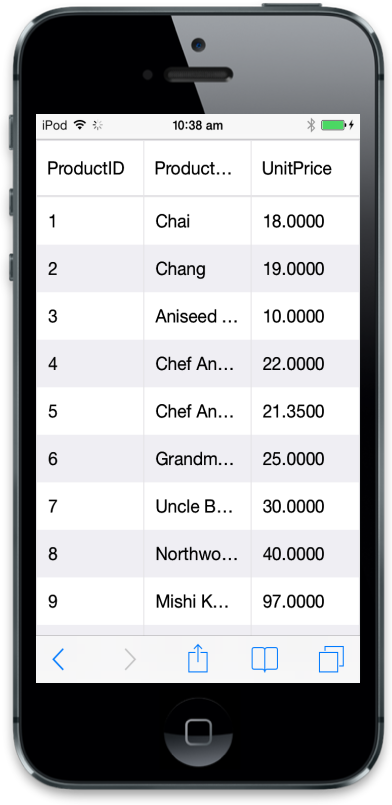

# Data binding

## Local data

Mobile Grid data source can be set in server-side through ASP.NET MVC by using ViewBag.

To achieve this refer the following code example.



@(Html.EJMobile().Grid<object>("MobileGrid")

.Datasource((IEnumerable<object>)ViewBag.datasource)

.Columns(col =>

{

col.Field("FirstName").HeaderText("First Name").Add();

col.Field("LastName").HeaderText("Last Name").Add();

col.Field("Email").HeaderText("Email").Add();

}))





namespace MVCSampleBrowser.Controllers.Grid

{

public class GridController : ApplicationController

{

public class Person

{

public string FirstName { get; set; }

public string LastName { get; set; }

public string Email { get; set; }

}

public ActionResult Default()

{

List<Person> Persons = new List<Person>();

Persons.Add(new Person() { FirstName = "John", LastName = "Beckett", Email = "john@syncfusion.com" });

Persons.Add(new Person() { FirstName = "Ben", LastName = "Beckett", Email = "ben@syncfusion.com" });

Persons.Add(new Person() { FirstName = "Andrew", LastName = "Beckett", Email = "andrew@syncfusion.com" });

ViewBag.datasource = Persons;

return View();

}

}

}




Execute the above code to render the following output.

## Remotedata

### oData binding

oData is standardized protocol for creating and consuming data. You can able to retrieve data from oData service using DataManager. Here is an example of remote Data binding using oData service.



@(Html.EJMobile().Grid<object>("MobileGrid")

.Datasource("http://mvc.syncfusion.com/Services/Northwnd.svc/Orders")

.Columns(col =>

{

col.Field("OrderID").HeaderText("Order ID").Add();

col.Field("CustomerID").HeaderText("Customer ID").Add();

col.Field("Freight").HeaderText("Freight").Add();

}))



Execute the above code to render the following output.

Note: For information about DataManager with Mobie Grid check DataAdaptors concept.

## Loadatonce

Through this load at once technique, you can able to load all remote data from server to grid and process records in client side. You can check load at once with grid.



@(Html.EJMobile().Grid<object>("MobileGrid")

.Datasource(d=>d.URL("http://mvc.syncfusion.com/Services/Northwnd.svc/Orders/")
.Offline(true))

.AllowPaging(true)

.Columns(col =>

{

col.Field("OrderID").HeaderText("Order ID").Add();

col.Field("CustomerID").HeaderText("Customer ID").Add();

col.Field("ShipCity").HeaderText("Ship City").Add();

}))



Execute the above code to render the following output.

## Cross domain

ejmGrid can use CrossDomain data service with help of data manager. Following configuration is to configure in client side. You need to configure server to retrieve data from server code. For server configuration, you can refer this link ([https://developer.mozilla.org/en-US/docs/Web/HTTP/Access_control_CORS](https://developer.mozilla.org/en-US/docs/Web/HTTP/Access_control_CORS)). Here you can learn how to use or retrieve cross domain data from Grid.



@(Html.EJMobile().Grid<object>("MobileGrid")

.Datasource(d => d.URL("http://mvc.syncfusion.com/UGService/api/Orders")
.CrossDomain(true).Offline(true))

.AllowPaging(true)

.Columns(col =>

{

col.Field("OrderID").HeaderText("Order ID").Add();

col.Field("CustomerID").HeaderText("Customer ID").Add();

col.Field("ShipCity").HeaderText("Ship City").Add();

}))



Execute the above code to render the following output.

## Load on Demand 

Load on demand is a powerful technique that is used to reduce bandwidth size of consuming data. In ejGrid, you have support to use load on demand. In the following example, oDataservice is used. At load time, it retrieves required data from service, only for the visible page and not for all records. And when you move to another page, it loads for current page. You no need to configure Grid to enable load on demand, since load on demand is enabled by default in Grid. The following code example illustrates you on how load on demand works with MobileGrid.



@(Html.EJMobile().Grid<object>("MobileGrid")

.Datasource("http://mvc.syncfusion.com/Services/Northwnd.svc/Orders/")

.Columns(col =>

{

col.Field("OrderID").HeaderText("Order ID").Add();

col.Field("CustomerID").HeaderText("Customer ID").Add();

col.Field("Freight").HeaderText("Freight").Add();

})

.AllowPaging(true)) 



Execute the above code to render the following output.

## Refresh data source

ejmGrid contains a feature to refresh datasource dynamically after Grid initialization. It is useful to refresh grid data source.




@(Html.EJMobile().Grid<object>("MobileGrid")

.Datasource((IEnumerable<object>)ViewBag.datasource)

.Columns(col =>

{

col.Field("FirstName").HeaderText("First Name").Add();

col.Field("LastName").HeaderText("Last Name").Add();

col.Field("Email").HeaderText("Email").Add();

}))

@Html.EJMobile().Button("Button").Text("Refresh").ClientSideEvents(c => c.TouchEnd("RefreshData")) ()









namespace MVCSampleBrowser.Controllers.Grid

{

public class GridController : Controller

{

public class Person

{

public string FirstName { get; set; }

public string LastName { get; set; }

public string Email { get; set; }

}

public ActionResult GridView()

{

List<Person> Persons = new List<Person>();

Persons.Add(new Person() { FirstName = "John", LastName = "Beckett", Email = "john@syncfusion.com" });

Persons.Add(new Person() { FirstName = "Ben", LastName = "Beckett", Email = "ben@syncfusion.com" });

Persons.Add(new Person() { FirstName = "Andrew", LastName = "Beckett", Email = "andrew@syncfusion.com" });

ViewBag.datasource = Persons;

return View();

}

}

}




## Supported DataTypes

ejmGrid supports data types in JavaScript such as string, number, datetime and Boolean. By default, ejmGrid reads datatypes from Mobile Grid Datasource. Grid uses these DataTypes for filtering and other operations. You can also customize these DataTypes through column property type. It overrides default data type reading. For example refer the following code.







@(Html.EJMobile().Grid<object>("Grid")

.Datasource(ds => { ds.Table("#table1"); })

.Columns(col =>

{

col.Field("Laptop").HeaderText("Laptop Brands").Add();

col.Field("Model").HeaderText("Model").Add();

col.Field("Price").HeaderText("Price").TextAlign(TextAlign.Right).Width(90).Add();

}))



Execute the above code to render the following output.

_HTML binding_

## oData Adaptor

Now a days oData is most useful technique in consuming data. You can use oData protocol through Data Manger’s OData adaptor. Refer the following code to use oData adaptor with Grid.



@(Html.EJMobile().Grid<object>("MobileGrid")

.Datasource("http://mvc.syncfusion.com/Services/Northwnd.svc/Products/")

.Columns(col =>

{

col.Field("ProductID").HeaderText("Product ID").Add();

col.Field("ProductName").HeaderText("Product Name").Add();

col.Field("UnitPrice").HeaderText("Unit Price").Add();

}))



Execute the above code to render the following output.

