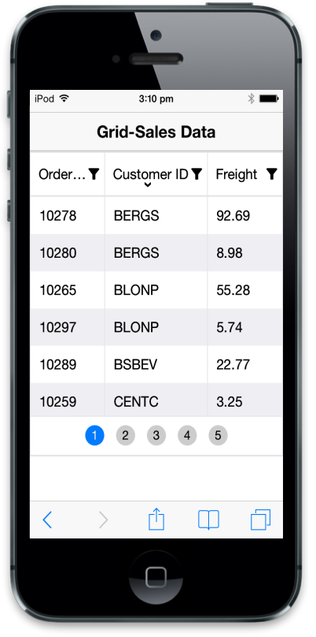
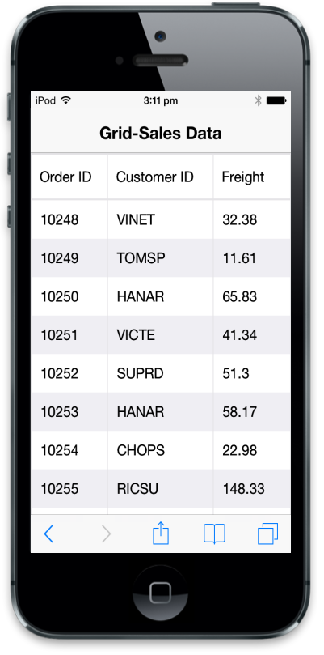
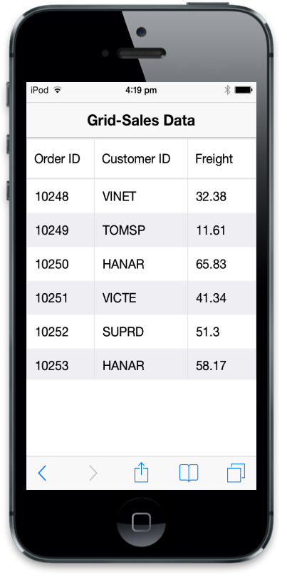
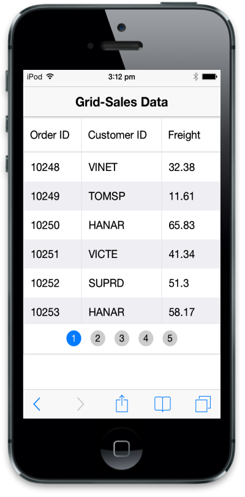
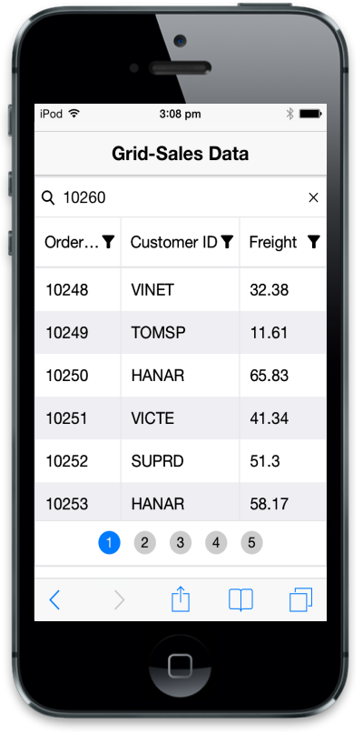
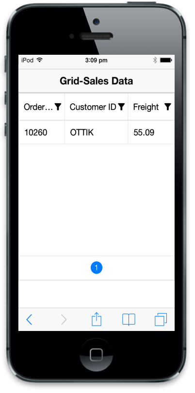

# Getting Started

In this section, you will learn how to create Grid using MVC in mobile app.

## Create your first Grid in MVC

ASP.NET MVC Mobile Grid is a feature-rich Grid component that can handle a large amount of data. It is very easy to use and includes features like data binding, filtering, paging, and sorting. You can make use of the Mobile Grid control to generate complex Grid-based reports. In the following guidelines, you can learn its features in Mobile Grid widget by creating a Sales Data Grid. 

## Create the necessary layout 

ASP.NET MVC Mobile Grid is rendered only by specifying the data source based on the default values of all the properties. You can easily customize Mobile Grid control by changing its properties according to your requirements. Create a simple MVC application and add the following header and scrollpanel layout page content inside the <body> tag of layout.cshtml. Create an MVC Project and add necessary Dlls and scripts with help of the [MVC-Getting Started Documentation.](http://help.syncfusion.com/js/)



<!-- Layout Page Content -->

    <!-- header control -->

    @Html.EJMobile().Header("header").Title("Grid-Sales Data ")

          @RenderBody()

    <!-- ScrollPanel -->

    @Html.EJMobile().Scrollpanel("scrollpanel").Target("content")

    <!-- View Page Content -->

    

    



## Create the Grid

In your Sales Data Grid, you require three columns to display the Order Id, Customer Id, and Freight.  Add a Grid control in the index.cshtml page. In Columns definition, the HeaderText property allows you to specify the header text for each column. The data source is set using the Datasource property and its columns are configured using the Columns property. You can set specific properties for each field by using Columns property. Its Datasource property accepts both IEnumerable and string type values that are used to get the web service URL.

Add the following code example in your corresponding view page.



<div id="content">

    

        <!--Mobile Grid control  -->

        @(Html.EJMobile().Grid<object>("mobgrid")
        .Datasource("http://mvc.syncfusion.com/Services/Northwnd.svc/Orders")

        .Columns(col =>

           {

             col.Field("OrderID").HeaderText("Order ID").Add();

             col.Field("CustomerID").HeaderText("Customer ID").Add();

             col.Field("Freight").HeaderText("Freight").Add();

           })

 )

    



Execute the above code example to render the following output.

## Grid with Scrolling

Scroll is used to view all the content present in the Grid, when the screen size is smaller than the Grid content. To enable Scrolling, you can set the AllowScrolling property to ‘true’. This enables the Scrollpanel in the Grid.  You can use the ScrollOption property to set scrollpanel properties. You can set the scrollpanel height using Height property.



<div id="content">

    

           <!--Mobile Grid control  -->

           @(Html.EJMobile().Grid<object>("mobgrid")
           .Datasource("http://mvc.syncfusion.com/Services/Northwnd.svc/Orders")

.AllowScrolling(true)

.ScrollSettings(scroll =>

            {

              scroll.Height(220);

            })

           .Columns(col =>

           {

             col.Field("OrderID").HeaderText("Order ID").Add();

             col.Field("CustomerID").HeaderText("Customer ID").Add();

             col.Field("Freight").HeaderText("Freight").Add();

           })

    )

    



Execute the above code to render the following output.

## Grid with Paging

Paging offers complete navigation support to easily switch between the pages. You can achieve this by using the Pager bar available at the bottom of the Mobile Grid control. To enable Paging, use AllowPaging property of the Grid as given in the following example. Pager is scrolled horizontally when its width exceeds the target window. Use PageSettings property to set Paging properties. The PageSize property describes the number of records to be displayed in single GridPage. 



<div id="content">

    

           <!--Mobile Grid control  -->

           @(Html.EJMobile().Grid<object>("mobgrid")
           .Datasource("http://mvc.syncfusion.com/Services/Northwnd.svc/Orders")

           .AllowScrolling(true)

           .ScrollSettings(scroll =>

            {

              scroll.Height(220);

            })

           .AllowPaging(true)

           .PageSettings(page => 
            {

             page.PageSize(10);

            })

           .Columns(col =>

            {	

             col.Field("OrderID").HeaderText("Order ID").Add();

             col.Field("CustomerID").HeaderText("Customer ID").Add();

             col.Field("Freight").HeaderText("Freight").Add();

            })

    )

    



Execute the above code to render the following output.

## Grid with Filtering

A Filter allows you to extract a subset of records that meet certain criteria. Filters are applied to one or more columns. To enable Filtering, you can use AllowFiltering property of the Grid.

Click the Filter icon in column header to make the Filtering textbox visible. Then enter searchcontent to filter your MobileGrid data.



<div id="content">

    

           <!--Mobile Grid control  -->

           @(Html.EJMobile().Grid<object>("mobgrid")
           .Datasource("http://mvc.syncfusion.com/Services/Northwnd.svc/Orders")

           .AllowScrolling(true)

           .ScrollSettings(scroll =>

            {

              scroll.Height(220);

            })

.AllowPaging(true)

           .PageSettings(page => 
            {

             page.PageSize(10);

            })
. AllowFiltering(true)

           .Columns(col =>

            {

             col.Field("OrderID").HeaderText("Order ID").Add();

             col.Field("CustomerID").HeaderText("Customer ID").Add();

             col.Field("Freight").HeaderText("Freight").Add();

            })

    )

    



N> The Filter query is a combination of value and symbols (“<, >, =, etc). For example, you can provide “<10255” in Order ID column. The numeric columns are filtered by using the symbols ‘<’, ‘>’, ‘=’, ‘<=’, ‘>=’, ‘!’ and the string columns are filtered by using the symbols “%” (for startswith and endswith) and “*” (contains). Also, you can use “&&” and OR operator to provide multiple conditions in single column.

Execute the above code, and then click the OrderID column header to render the following output.

In the above output, it is clear that OrderIdFilter is selected and the OrderIdFilter column is filled with the value 10260.

## Sortable Grid Columns

You can Sort column data either in ascending or descending order. To enable Sorting, you can use AllowSorting property of Grid and click the column header to sort the Grid columns. The down arrow indicates that the column is sorted in ascending order and up arrow indicates that the column is sorted in descending order. If there is no arrow, it means the sorting is cleared.



<div id="content">

    

           <!--Mobile Grid control  -->

           @(Html.EJMobile().Grid<object>("mobgrid")
           .Datasource("http://mvc.syncfusion.com/Services/Northwnd.svc/Orders")  
           .AllowScrolling(true)

           .ScrollSettings(scroll =>

            {

              scroll.Height(220);

            })

.AllowPaging(true)

           .PageSettings(page => 
            {

             page.PageSize(10);

            })
           . AllowFiltering(true) 
. AllowSorting(true)

           .Columns(col =>

            {

             col.Field("OrderID").HeaderText("Order ID").Add();

             col.Field("CustomerID").HeaderText("Customer ID").Add();

             col.Field("Freight").HeaderText("Freight").Add();

            })

    )

    



