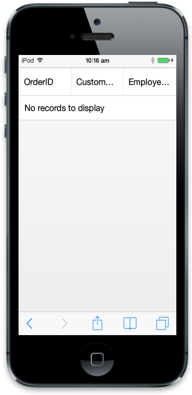

# Initialize ejmGrid

In this section, you can learn the Mobile Grid’s mandatory property to render a simple Grid. To initialize Grid, it needs two important properties. They are columns and its inner property field. Columns are used to define schema of grid and field is mapping name to data source.



$("#MobileGrid").ejmGrid({

     columns: [

        { field: "OrderID" },

        { field: "CustomerID" },

        { field: "EmployeeID" }

     ]

});



Execute the above code to render the following output.

'

_Empty grid_

