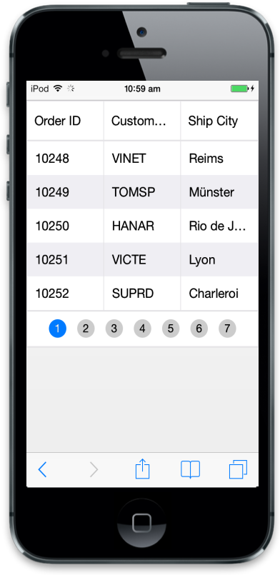
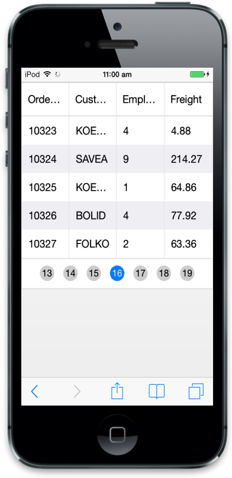

# Paging

Paging is a powerful technique in Mobile Grid that is used to Navigate from one page to another. Using this pager you can implement load on demand concept where it loads only required data to Grid. To enable paging in Grid set AllowPaging as true at Mobile Grid initialize.

## Default

When the AllowPaging is set as true, the properties in the PageSettings take the following default values.

* pageSize-5
* currentPage-1

Refer the following code example for Grid with default options.



@(Html.EJMobile().Grid<object>("Grid")

        .Datasource((IEnumerable<object>)ViewBag.datasource)

.AllowPaging(true))





namespace MVCSampleBrowser.Controllers

{

public partial class GridController : Controller

{

public ActionResult Paging()

{

var DataSource = new NorthwindDataContext().OrdersViews.ToList();

ViewBag.datasource = DataSource;

return View();

}

}

}



Execute the above code to render the following output.

## Pager Types

There are two types of pagers available in Mobiel Grid. They are,

* Scrollable Pager
By specifying pager type as “Scrollable” you can use this type of pager. By using this, you can scroll the pager bar for easy navigation.
* Normal Pager
By specifying pager type as “Normal” you can use this type of pager. This pager contains first, last, next and previous buttons for navigation.

In this section, you can learn how the pager types differ in Mobile Grid control. Refer the following code example for pager types.



@(Html.EJMobile().Grid<object>("MobileGrid")

.Datasource(d => d.URL("http://mvc.syncfusion.com/Services/Northwnd.svc/Orders/").Offline(true))

.Columns(col =>

{

col.Field("OrderID").HeaderText("Order ID").Add();

col.Field("CustomerID").HeaderText("Customer ID").Add();

col.Field("EmployeeID").HeaderText("Employee ID").Add();

col.Field("Freight").HeaderText("Freight").Add();

})

.AllowPaging(true)

.PageOption(p=>p.Type(PagerType.Scrollbale)))



Execute the above code to render the following output.

