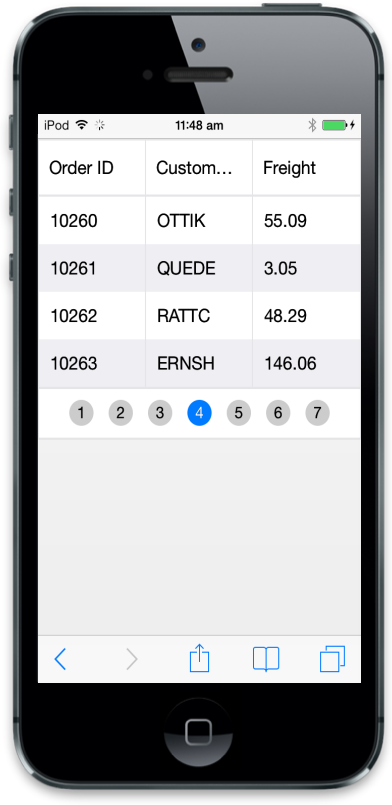

# Persist 

This section explains you on how to maintain Grid state. Refer the following code example.



@(Html.EJMobile().Grid<object>("MobileGrid")

.Datasource("http://mvc.syncfusion.com/Services/Northwnd.svc/Orders")

.Columns(col =>

{

col.Field("OrderID").HeaderText("Order ID").Add();

col.Field("CustomerID").HeaderText("Customer ID").Add();

col.Field("Freight").HeaderText("Freight").Add();

})

.EnablePersistence(true))



Execute the above code to render the following output.

